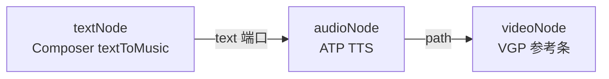

# 音频节点七种状态 · 风格与交互设计方案

> **版本**：1.0（规划）  
> **日期**：2026-05-20  
> **状态**：**A1–A4 已实现（2026-05-20）** — 状态机、分工、显隐以本文为准；实现见附录 A  
> **迭代层**：CanvasExperienceLayer  
> **基准规范**：[`docs/node-ui-spec/canvas-node-chrome-spec.md`](../node-ui-spec/canvas-node-chrome-spec.md)  
> **对齐范本**：[`text-node-states-spec.md`](./text-node-states-spec.md)（六层分工、工作流容器、显隐矩阵）  
> **实现入口**：`src/components/nodes/MinimalAudioNode.tsx` · `AudioTtsPanel.tsx` · `AudioTtsPanelPortal.tsx`

---

## 1. 文档用途与产品范围

### 1.1 两大核心场景（你当前在做的）

| 场景 | 拓扑 | 用户心智 | 参数归谁 |
|------|------|----------|----------|
| **文生音频（TTS）** | 孤立 `audioNode`，或 `textNode → audioNode` | 「写词 → 选模型/音色 → 生成 mp3 写入节点」 | **音频节点**底栏 ATP（Audio Tts Panel） |
| **声音参考进视频** | `audioNode → videoNode`（可叠加图/视频参考） | 「这段音频作为全能参考里的声音样本」 | **视频节点** VGP；音频节点只维护素材 |

### 1.2 与文本节点的对称关系

| 维度 | 文本节点 | 音频节点 |
|------|----------|----------|
| 壳内主内容 | `data.prompt` 正文 | `data.path` / `data.assetId` 波形预览 |
| 生成参数面板 | Composer（孤立起稿） | ATP（TTS 文案 + 模型 + 音色） |
| 工作流容器（被动） | `isPassiveTextContainer`：连线后无底栏 | `isPassiveAudioAsset`：连视频后 **弱化/收起 ATP**，强调试听与路径 |
| 上游文案 | 图/视频/脚本 → 写 `prompt` | **文本 → 音频**：文案在文本侧起稿，**合成在音频侧** |
| 下游消费 | 视频/图/脚本/音频读 `prompt` | 视频读 `path` 进 `referenceAudioPaths` |

### 1.3 不在本迭代范围

- 非 TTS 的音乐生成 API（Mureka 等）专用 UI — 仍可用 ATP + OpenAI `/audio/speech` 占位，不单独做「图六音乐条」
- 音频节点内嵌视频时间轴剪辑
- 浏览器 `npm run dev` 下的真实 TTS（需 Tauri）

---

## 2. 核心模型：素材壳 + TTS 底栏 + 双工作流

### 2.0 用户心智（真源）

音频节点的本质是 **`path` / `assetId` 素材载体**；`data.prompt` 仅表示 **待 TTS 的文案**（与 Inspector、脚本同步共用字段）。

```text
                    ┌─ 顶栏 Portal（有素材 + 单选）──────────────┐
                    │  试听 / 替换 / 导出 / 定位下游视频          │
                    └────────────────────────────────────────────┘
  左上：标签（外置）                    右上：时长 | 生成中 N%
┌─ 节点壳（随画布缩放）────────────────────────────────────────────┐
│  空态：♪ glyph +「上传或拖入」                                    │
│  有素材：<audio> 波形条 + 播放控件（NodeMediaPreview kind=audio）   │
│  ⊕ SimpleAnchors（左 in：audio/text/script · 右 out：audio）       │
└────────────────────────────────────────────────────────────────┘
                    ┌─ 底栏 Portal 500px（AudioTtsPanel）──────────┐
                    │  模型 · 音色 · 文案 · 脚本绑定 · ↑ 生成       │
                    └────────────────────────────────────────────┘
```

| 方向 | 典型连线 | 行为 |
|------|----------|------|
| **入** | `textNode → audioNode` | 文本侧 `textToMusic` Composer 写 **音乐/旁白描述**；**TTS 文案与合成在音频 ATP**（见 §5.1） |
| **入** | `scriptNode → audioNode` | `scriptBeatId` 绑定镜头；ATP「从脚本同步」填 `prompt` |
| **入** | 上传 / 拖入 / 媒体库 | 直接写 `path`，与 TTS 无关 |
| **出** | `audioNode → videoNode` | 视频 VGP 缩略条出现 ♪ 格；`detectWorkflow` → `multimodal_reference`；草稿 `referenceAudioPaths` |
| **出** | `audioNode → textNode` | **禁止**（连接策略无此边） |

**硬规则（对齐文本 v1.1）**：

1. 连到 **视频** 且已有有效 `path` 时，音频节点进入 **S6 参考输出容器**：默认 **不自动弹出 ATP**，顶栏提示「已作为视频声音参考」+「定位视频节点」。
2. **文生音频** 参数（模型、音色、发送）**只在音频节点 ATP**，不在文本节点底栏堆 TTS 控件（文本仅 `textToMusic` 布局 + 定位音频）。
3. 上游 **文本已连接** 时，文本节点为 **被动容器**（无 Composer），避免双文案源；文案同步策略见 §5.1。

实现锚点（规划）：`src/lib/audioNodeContainerMode.ts`（新建，镜像 `textNodeContainerMode.ts`）。

### 2.1 为什么是「七种」展示态

与文本节点相同：**S0** = 未展开（未单选 / 多选 / 拖拽 suppress）；**S1–S6** = 单选且 `expandedChrome`。

底栏种类 **不再** 按旧 NodeFrame 的 `audioTtsPanelNodeId` 手风琴内嵌区分，迁 Chrome 后统一 **Portal 底栏 ATP** + 显隐矩阵。

### 2.2 七种工作状态（S1–S6 + S0）

| ID | 名称 | 用户心智 | 进入条件（充分） |
|----|------|----------|------------------|
| **S0** | 未展开 | 画布上扫一眼 | `¬expandedChrome` |
| **S1** | 空态引导 | 刚放上画布，要上传或 TTS | `expandedChrome` ∧ `¬hasAsset` |
| **S2** | 素材浏览 | 已有音频，试听/管理 | `hasAsset` ∧ `¬editingLabel` ∧ `¬showAtpPortal`（默认） |
| **S3** | TTS 配置 | 正在选模型、写词、准备合成 | `expandedChrome` ∧ `showAtpPortal`（见 §4.1） |
| **S4** | 脚本驱动 | 镜头台词进 TTS | 存在有效 `scriptBeatId` + 上游 `scriptNode` 连线 |
| **S5** | 文本下游 | 旁白/配音描述在文本起稿 | 存在 `textNode → audioNode` 入边（`textWorkflow=textToMusic` 在文本侧） |
| **S6** | 视频参考输出 | 作为视频全能参考的声音样本 | 存在 `audioNode → videoNode` 出边 ∧ `hasAsset` |

`hasAsset = Boolean(path?.trim() || assetId?.trim())`。

**注意**：S4 / S5 / S6 可与 S2 / S3 **叠加**（例如 S5+S3：有文本上游且用户打开 ATP 改词合成）。

### 2.3 六层分工（能力归谁）

| 层 | 职责 | 组件 / 入口 | 不做什么 |
|----|------|-------------|----------|
| **L1 壳** | 波形/空态、拖入上传、播放 | `nodeChrome-shell` + `NodeMediaPreview` | 不放模型下拉 |
| **L2 外置元信息** | 标题、文件名摘要、TTS 进度 | `NodeMetaLabel` / `NodeMetaStatus` | 不占壳内 |
| **L3 顶栏** | 有素材后的轻操作 | `AudioPreviewToolbarPortal`（规划） | 不做 TTS 长表单 |
| **L4 ATP** | TTS 文案、模型、音色、发送 | `AudioTtsPanel` + `AudioTtsPanelPortal` | 视频参考态默认关（§4） |
| **L5 工作流底栏** | （废止在文本/视频重复） | — | 文本不嵌 `AudioTtsPanel`（已废止 `TextNodeTextToMusicPanel` 叠层） |
| **L6 图结构** | 发现伙伴节点、静默 sync | 连线 + `inferTextWorkflowPatch`（文本侧）+ 视频 `useVideoIncomingReferenceItems` | 壳内四入口 Chip |

**数据分工**：

| 字段 | 含义 |
|------|------|
| `data.path` / `data.assetId` | 成片音频（上传或 TTS 产出） |
| `data.prompt` | ATP 文案（TTS input） |
| `data.params.scriptBeatId` | 脚本镜头绑定 |
| `data.params.providerId` / `model` / `voice` | （规划）持久化上次 ATP 选择 |
| 文本侧 `params.audioNodeId` | `textToMusic` 关联，供 Composer「定位音频节点」 |

---

## 3. 全局谓词

```ts
expandedChrome =
  selected && !nodeDragSuppressUi && selectedNodeIds.length === 1

hasAsset = Boolean(data.path?.trim() || data.assetId?.trim())

// 规划：镜像文本
isPassiveAudioAsset =
  hasOutgoingTo(videoNode) && hasAsset
  // 或：仅连视频、无 TTS 意图时可收紧为「出边到 video 且用户未钉住 ATP」

showAtpPortal = expandedChrome && uiSelected && (
  !isPassiveAudioAsset || audioTtsPanelPinnedNodeId === nodeId
) && (
  !hasAsset || audioTtsPanelPinnedNodeId === nodeId || audioTtsPanelOpenNodeId === nodeId
)

// 现行 store（迁移前）
showTtsPanel = audioTtsPanelNodeId === nodeId  // 双击/右键打开
```

**workflow 检测（视频侧，已实现）**：

- 入边含 `audioNode` 且有 path → `detectWorkflow` → `multimodal_reference`
- 缩略条：`incomingRefsForDisplayStrip`，音频上限 `VIDEO_REFERENCE_AUDIO.maxCount`（3），总时长 ≤15s

---

## 4. 显隐矩阵（规划真源）

图例：**开** / **关** / **—**  
前提：S1–S6 默认 `expandedChrome === true`；S0 首行。

| 状态 | L1 壳 | L3 顶栏 | L4 ATP Portal | 上传浮动钮 | Simple 锚点 | 外置「上传」条 |
|------|-------|---------|---------------|------------|-------------|--------------|
| **S0** | 紧凑预览/空 glyph | 关 | 关 | 关 | 开 | 关 |
| **S1** | 空态 ♪ + 占位 | 关 | **开**（默认） | **开**（选中上空） | 开 | 开 |
| **S2** | 波形 + 播放 | **开** | 关（默） | 关 | 开 | 关 |
| **S3** | 同 S2 或 S1 | 关 | **开** | S1 开 / S2 关 | 开 | 随 S1 |
| **S4** | 同 S2 | 开 + 脚本同步提示 | 开（含 `ScriptBeatBindingInline`） | 关 | 开 | 关 |
| **S5** | 同 S2 | 开 +「定位文本节点」 | 开（文案以音频 `prompt` 为准） | 关 | 开 | 关 |
| **S6** | 同 S2 + 角标「参考」 | **开**（试听/替换/定位视频） | **关**（默） | 关 | 开 | 关 |

### 4.1 ATP 打开规则（规划，对齐文本 Composer）

```text
expandedChrome
∧ uiSelected
∧ (¬isPassiveAudioAsset ∨ audioTtsPanelPinnedNodeId === nodeId)
∧ (¬hasAsset ∨ pinned ∨ userOpenedAtp)
```

| 触发 | 行为 |
|------|------|
| 单击选中空节点 | S1 + 默认开 ATP |
| 双击节点 / 右键节点 | `audioTtsPanelOpenNodeId = id`（现行 `audioTtsPanelNodeId`） |
| 单击画布 | 关 ATP + 取消 pin |
| `Ctrl+Shift+G`（规划） | 单选音频 → 钉住 ATP；若 S6 → toast「声音参考已就绪，请在视频节点生成」 |
| 文本 Composer「定位音频节点」 | 选中音频 + 开 ATP + `fitView` |

**Modal（规划）**：`AudioTtsPanelExpandedModal`，类名 `atp-layout-expanded`，Esc 关闭；**Modal 开时底栏 Portal 关**（同文本 Composer）。

### 4.2 顶栏（规划 · `AudioPreviewToolbar`）

| 分组 | 动作 | 条件 |
|------|------|------|
| 播放 | 播放/暂停、进度（壳内亦可） | `hasAsset` |
| 素材 | 替换上传、复制路径、在文件夹显示 | `hasAsset` + Tauri |
| 工作流 | 定位视频节点 / 定位文本节点 | 有对应连线 |
| 工具 | 展开 ATP、钉住 ATP | `expandedChrome` |

**不开顶栏**：S0、S1 空态（与文本「无正文不开 Portal」一致）。

### 4.3 上传交互

| 场景 | 行为 |
|------|------|
| 空态选中 | 壳上方浮动「上传」（对齐 `ImageNodeEmptyUpload`） |
| 有素材 | 顶栏「替换」；壳内点击不弹文件选择（防误触） |
| 拖放 | `FlowCanvas` 落点 → `assignImportedMediaToNode`（已实现） |
| 格式 | mp3 / wav / flac / m4a / aac / ogg（现行 accept） |

---

## 5. 工作流详解

### 5.1 文生音频：`textNode → audioNode`



| 步骤 | 节点 | UI |
|------|------|-----|
| 1 | 文本 | 孤立或连音频前：Composer `layout=textToMusic`，占位「描述您想要的音乐/旁白」；**发送不直接 TTS** |
| 2 | 文本 | 连上音频后：文本变 **被动容器**（关 Composer）；`params.audioNodeId` 静默写入 |
| 3 | 音频 | 用户双击打开 ATP；文案写入 `audioNode.data.prompt`（**规划**：支持从文本 `prompt` 一次性同步按钮，避免双字段漂移） |
| 4 | 音频 | ATP 选模型/音色 → ↑ 生成 → `path` 更新 |
| 5 | 视频（可选） | 再连 `audio → video`，进入 S6 |

**已决（对齐文本 v1.1）**：

- 文本 **不** 内嵌 `AudioTtsPanel`（`TextNodeTextToMusicPanel` 仅保留迁移期，目标删除）。
- 文本 Composer 仅保留 **关联提示 + 定位音频**（现行 `tgp-ttm-refRow`）。

**待决 P1**：文本 `prompt` 与音频 `prompt` 自动双向同步策略（建议：连接时若音频 `prompt` 空则拷贝文本 `prompt` 一次；之后各改各的，ATP 显式「从文本同步」）。

### 5.2 声音参考：`audioNode → videoNode`

| 项 | 约定 |
|----|------|
| 连接 | `flowConnectionPolicy`：`videoNode` 接受 `audio` 端口 |
| 视频 UI | `VideoMultimodalInputPanel` 缩略 `mmThumbAudio`（♪）；workflow Tab **只读** 亮起「全能参考」 |
| 约束提示 | 产品文案：`mp3/wav`，≤3 条，总时长 ≤15s（`VIDEO_REFERENCE_AUDIO`） |
| 音频节点 S6 | 顶栏「定位视频节点」；ATP 默认关；壳角标「声音参考」 |
| 超限 | 视频侧计数裁剪；音频节点可选外置灰字「已有 N 路参考，可能超出视频上限」 |

**与文本 → 视频的区别**：文本提供 **语义 prompt**；音频提供 **声学参考文件**。二者可同时连入同一 `videoNode`（全能参考 + 文生视频提示词）。

### 5.3 脚本 → 音频（TTS 镜头）

| 项 | 约定 |
|----|------|
| 绑定 | `ScriptBeatBindingInline` + `params.scriptBeatId` |
| 同步 | ATP「从脚本同步」→ `buildAudioTtsTextFromScriptBeatBinding`（已实现） |
| 空台词 | 按钮 disabled + status 文案（已实现） |

### 5.4 锚点菜单（L6）

| 锚点方向 | 动作 | 结果 |
|----------|------|------|
| 文本 ⊕ 出 | 音频 | 创建/聚焦 `audioNode`，文本 `textToMusic` |
| 音频 ⊕ 出 | 视频 | 创建/聚焦 `videoNode`，连参考边 |
| 音频 ⊕ 入 | 文本 / 脚本 | 策略允许则连入 |

---

## 6. ATP 底栏规范（对齐 `textGenPanel--chrome` / `videoGenPanel--chrome`）

| 项 | 约定 |
|----|------|
| 容器类名 | `audioTtsPanel--chrome`（外层 `audioNodeChrome--minimal`） |
| 宽度 | **500px**（`GEN_PANEL_CHROME_WIDTH`） |
| 标题行 | 「文字转语音」+ 展开/钉住/收起（`mmChromeIconBtn`） |
| 参数行 | 模型 `select` → **规划** `AudioModelPicker` Portal；音色 pill |
| 文案区 | `textarea`，`AUDIO_TTS_PROMPT_MAX_CHARS`，右下角计数 |
| 脚本行 | `ScriptBeatBindingInline` +「从脚本同步」 |
| 底栏 | 左：协议 hint（mono）；右：`igp-generate-btn` 样式 ↑ / ■ |
| Token | 复用 `--tgp-control-*` / `--vgp-control-*`，音频专用 `--atp-*`（规划加在 `AudioNodeChrome.css`） |

**生成态**：`runNodeTaskAgent` + `audioTtsAgentRuntime`；`data.status` 外置右上「生成中」；完成后刷新 `assets` 列表。

---

## 7. 设计 Token 与壳尺寸（迁 Chrome 时）

| 项 | 建议值 | 说明 |
|----|--------|------|
| 壳比例 | 固定 **1:1** 或 **4:3** 宽扁条（音频不像图，宜横向波形条） | 规划 `AUDIO_NODE_ASPECT = 16/9` 宽条 |
| 长边 cap | `AUDIO_NODE_MAX_EDGE = 400` | 低于图片 500，突出「条带」 |
| 空态色 | `--text-placeholder` ♪ glyph | 同 `audioAssetMusicGlyph` |
| tone | `tone="audio"` → 外置标签前缀「音频」 | 现行 `NodeFrame` |

**类名演进**：

| 现行 | 目标 |
|------|------|
| `audioAssetCard` | `audioNodeChrome--minimal` |
| `audioAssetPreviewShell` | `nodeChrome-preview` |
| `audioTtsPanel` | `audioTtsPanel--chrome` |

---

## 8. 交互规范（汇总）

| 操作 | 行为 |
|------|------|
| 单击壳 | 选中；S2 不自动开 ATP |
| 双击节点 | 打开 ATP（现行）；规划：空节点 fitView，有素材可选仅开顶栏 |
| 右键节点 | 同双击开 ATP（现行） |
| 双击画布空白 | 关 ATP、清 pin |
| Delete | 非输入焦点时删节点 |
| 滚轮在壳/ATP | `stopPropagation` |
| 连线完成 | 文本侧 `applyTextWorkflowSyncToNodes`；视频侧刷新缩略条 |
| Esc | 先关 Expanded Modal，再关 ATP，保持选中 |

---

## 9. 已决 / 待决 / 不做

### 9.1 已决

| 决策 | 说明 |
|------|------|
| TTS 参数在音频节点 | 不在文本底栏叠 ATP |
| 文本 `textToMusic` 仅引导 + 定位 | 与 `text-node-states-spec` §7.1 一致 |
| 视频消费 `path` | 不进音频节点改视频 draft |
| 连接策略 | `audioNode` 入：audio/text/script；出：audio；不可入 `scriptNode` |
| 双击/右键开 ATP | 现行行为保留至 Chrome 迁移 |
| 参考上限 | 以 `VIDEO_REFERENCE_AUDIO` 为准 |

### 9.2 待决（P1–P3）

| 项 | 选项 |
|----|------|
| 文本↔音频 `prompt` 同步 | 一次性拷贝 vs 显式同步钮（§5.1 建议） |
| S6 是否允许钉住 ATP | 允许改词重合成 vs 强制只看参考 |
| Chrome 迁移批次 | A：仅 Portal 化；B：`MinimalAudioNode` 全量 |
| 顶栏波形 scrub | P2 可选 |
| `params.voice` 持久化 | P1 建议存节点 data |

### 9.3 明确不做

- 文本节点底栏嵌 `AudioTtsPanel`（废止）
- 音频壳内模型四 Chip 入口
- 在音频节点内编辑视频生成参数
- 浏览器模式真实 TTS（保持 `DESKTOP_SHELL_HINT`）

---

## 10. 手动验收

1. **S0**：多选音频节点 → 无顶栏/ATP Portal。  
2. **S1**：新建空音频 → 空态 ♪；底栏 ATP 开；上传可用。  
3. **S3**：ATP 填词 → Tauri 生成 → 壳内可播放，`path` 有值。  
4. **S5**：文本 → 音频 → 文本无 Composer；文本可「定位音频」；音频 ATP 可合成。  
5. **S6**：音频（有 path）→ 视频 → 视频 VGP 见 ♪ 缩略；workflow 为「全能参考」；音频默认无 ATP。  
6. **脚本**：绑镜头 →「从脚本同步」→ 生成。  
7. **超限**：第 4 条音频入视频 → 视频条仅显示 3 路（或提示）。  
8. **Esc / 画布点击**：ATP 与 Modal 不叠层。  

---

## 附录 A · 实现对照表（2026-05-20）

> **对照文件**：`AudioAssetNode.tsx` · `AudioTtsPanel.tsx` · `TextComposerPanel.tsx` · `useVideoIncomingReferenceItems.ts`

| 项 | 规划 | 实现 | 备注 |
|----|------|------|------|
| Chrome 壳 | `audioNodeChrome--minimal` | ✅ | `MinimalAudioNode` |
| ATP Portal 500px | 锚 preview 下缘 | ✅ | `AudioTtsPanelPortal` |
| 顶栏试听工具 | `AudioPreviewToolbarPortal` | ✅ | 定位视频/文本、TTS、替换 |
| S6 默认关 ATP | `isPassiveAudioAsset` | ✅ | 钉住/双击/打开可覆盖 |
| 文本不嵌 ATP | 是 | ✅ | Composer 仅 ttm 行 |
| 视频 ♪ 缩略 | 是 | ✅ | `mmThumbAudio` |
| `detectWorkflow` + 音频 | multimodal_reference | ✅ | |
| 脚本同步 | ATP 内 | ✅ | |
| 从文本同步 | ATP 内 | ✅ | `onSyncFromText` |
| 双击开 ATP | 非 S6 | ✅ | `FlowCanvas` |
| 文本定位音频 | 是 | ✅ | `useFocusLinkedPartnerNode` + pin |
| 音频定位视频 | 顶栏 | ✅ | `AudioPreviewToolbar` |
| Expanded Modal | 是 | ✅ | `AudioTtsPanelExpandedModal` |
| SimpleAnchors | 是 | ✅ | `NodeAnchors variant=simple` |
| `audioTtsPanelPinnedNodeId` | 是 | ✅ | `canvasUiStore` |
| `Ctrl+Shift+G` | 音频钉住 ATP | ✅ | `App.tsx` |

### A.1 建议迭代顺序

| 批次 | 内容 | 模块数 |
|------|------|--------|
| **A1** | `audioNodeContainerMode` + S6 默认关 ATP + 顶栏「定位视频」 | 2 |
| **A2** | ATP Portal 化 + `audioTtsPanel--chrome` token | 2 |
| **A3** | `MinimalAudioNode` 替换 NodeFrame + SimpleAnchors | 3 |
| **A4** | `AudioTtsPanelExpandedModal` + pin + `Ctrl+Shift+G` | 2 |

---

## 11. 文档维护

| 变更类型 | 更新 |
|----------|------|
| 产品改显隐 | §4 矩阵 → 附录 A → 代码 |
| 新增连线拓扑 | §5 + `flowConnectionPolicy` |
| Chrome 迁移完成 | 更新 `docs/node-ui-spec/README.md` 索引 |

**维护者**：改 `AudioAssetNode` 任一 `show*` 条件时，同步附录 A。
