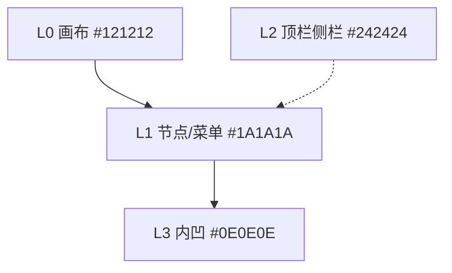

# 画布节点编辑器 UI 配色系统

> **状态**：设计真源（2026-05-21）  
> **适用范围**：CanvasFlow 无限画布、节点壳、连线、浮层菜单、锚点引入/引出、侧栏 Inspector；**不**覆盖云端 LibTV 商业后台。  
> **实现真源**：落地时同步更新 [`src/styles/global.css`](../../src/styles/global.css) 中的 CSS 变量；本文档优先于口头描述与参考图截图。

---

## 1. 设计目标

| 目标 | 含义 | 验收口径 |
|------|------|----------|
| **专注** | 界面退后，内容与操作路径靠前；色相不抢戏 | 除连线/状态/焦点外，背景不使用饱和色相 |
| **护眼** | 降低长时间盯屏刺激 | 不用 `#000`/`#FFF` 默认配对；控制脉冲动画与毛玻璃大面积 |
| **场景适配** | 画布 / 壳层 / 内凹编辑 / 浮层 / 时间线（远期）分层可读 | 各场景有对应 Surface token，禁止混用旧冷蓝灰 |

**行业参照**（取惯例，不抄色值）：DaVinci Resolve、Figma 暗色、Blender 节点编辑器——**中性 dark chrome + 小面积 accent + 媒体区保持中性内凹**。

**与 LibTV 参考图**：对齐**交互范式**（无限画布、五类节点、引出菜单、工作流连线），**不对齐**高饱和蓝线主导、青色 CTA 底、中性 `#121212/#242424` 纯灰轴（我们采用略暖的炭黑 + 柔白，与全彩预览更稳）。

---

## 2. 核心双色：深炭黑 + 柔白

### 2.1 为何略暖

- 纯冷灰蓝（如 `#111722` + `#E8ECF4`）长时间阅读易疲；  
- 略暖炭黑与略暖柔白在同一色相轴上，与节点内**全彩视频/图片**并存时不发「脏灰」；  
- accent 用**低饱和冷蓝**作对比，面积小即可识别，无需满屏蓝色。

### 2.2 基础色板

| Token | 色值 | 角色 |
|-------|------|------|
| `--cf-charcoal-canvas` | `#121212` | L0 无限画布底 |
| `--cf-charcoal-surface` | `#1A1A1A` | L1 节点壳、右键/引出菜单壳 |
| `--cf-charcoal-elevated` | `#242424` | L2 顶栏、Inspector 面板、工具条 |
| `--cf-charcoal-inset` | `#0E0E0E` | L3 预览 letterbox、输入深坑、表体暗底 |
| `--cf-soft-white` | `#E8E6E3` | 主文（柔白，非 `#FFFFFF`） |
| `--cf-soft-white-secondary` | `#A8A6A3` | 次文、菜单分区标题 |
| `--cf-soft-white-tertiary` | `#6E6C69` | 禁用、占位、弱化连线（候选） |

### 2.3 对比度

- 主文 `#E8E6E3` on `#1A1A1A`：满足 **WCAG AA** 正文对比（实现后用对比度工具抽测）。  
- 次文 `#A8A6A3` on `#1A1A1A`：满足辅助说明。  
- **禁止**默认使用 `#FFFFFF` on `#000000`。

---

## 3. 结构色（描边 / 悬停 / 阴影）

| Token | 值 | 用途 |
|-------|-----|------|
| `--cf-border` | `rgba(255, 255, 255, 0.08)` | 默认描边（节点、浮层、输入框） |
| `--cf-border-strong` | `rgba(255, 255, 255, 0.14)` | 选中、悬停锚点、强分割 |
| `--cf-hover` | `rgba(255, 255, 255, 0.06)` | 菜单行、列表行悬停 |
| `--cf-shadow-float` | `0 8px 24px rgba(0, 0, 0, 0.45)` | 浮层外阴影（轻量） |
| `--cf-shadow-inset` | `inset 0 0 0 1px rgba(255, 255, 255, 0.06)` | 可选；内凹区强调 |

**禁止**默认使用 `rgba(100, 116, 139, 0.55)` 蓝灰描边（旧图片节点语言）。  
**禁止**浮层菜单使用 `backdrop-filter: blur()` 作底色——会呈现灰雾旧外观，盖过炭黑实底。

---

## 4. Surface 分层

```text
L0  #121212     画布 + 点阵
L0.5 分组底板   **灰色填充** `--cf-group-plate-fill`；idle 虚线中性描边；**选中白描边** O-2（见 [分组底板 UI 规范](./group-plate-ui-spec.md)）
L1  #1A1A1A     节点卡片、右键/引出/引入菜单
L2  #242424     应用壳（顶栏、侧栏、Dock）
L3  #0E0E0E     节点内预览、脚本编辑区内凹
悬停 rgba(255,255,255,0.06)  菜单项、列表项（不抬升整卡色相）
```



**节点壳**：`#1A1A1A` **纯色**；**取消** `#151C27 → #111722` 冷蓝渐变。  
**所有** `nodeCard` 变体（含 `videoAssetCard`、`imageAssetCard`）遵守 L1，无半透明白壳例外。

---

## 5. 强调色与语义色（小面积）

原则：**除连线、焦点环、状态徽章、节点左条（可选）外，组件背景不得使用 hue 环上的饱和色。**

**色相约束（2026-05）**：系统 UI 仅允许 **黑 / 灰 / 白 / 红（危险）** 与 **青蓝强调色**。凡需彩色强调、成功、链接、运行中、节点类型条等，一律使用 `--cf-cyan-*` 族，禁止绿/紫/黄等其它色相（实现真源：`global.css` `:root`）。

| Token | 色值 | 用途 |
|-------|------|------|
| `--cf-cyan` / `--cf-cyan-light` / `--cf-cyan-deep` | `#38BDF8` / `#7DD3FC` / `#0EA5E9` | 青蓝主族 |
| `--cf-accent-focus` | `var(--cf-cyan-deep)` | 焦点环、主按钮、选中描边（可选） |
| `--cf-accent-flow` | `var(--cf-cyan-light)` | 连线选中/激活、运行中路径 |
| `--cf-edge-default` | `#9A9895` | 默认连线（策略 A，已定稿） |
| `--cf-edge-active` | `var(--cf-cyan-light)` | 选中/悬停连线 |
| `--cf-success` | `var(--cf-cyan)` | 成功、已生成 |
| `--cf-warning` | `var(--cf-cyan-light)` | 跳过、待处理（不再使用黄） |
| `--cf-danger` | `#D17B7B` | 失败、危险操作（唯一红色语义） |

强引导按钮：`--cf-accent-focus` 底 + `--cf-soft-white` 字；面积仍宜小。

**运行 vs 选中**：运行中用动画/脉冲 + `--cf-accent-flow`；选中用 `--cf-border-strong` 或 `--cf-accent-focus` 描边，避免二者仅同色无差异。

---

## 6. 节点编辑器

### 6.1 连线（已定稿）

**默认策略 A**：`#9A9895` 不透明（专注、低干扰）。实现常量见 [`src/lib/canvasColors.ts`](../../src/lib/canvasColors.ts)。

| 边状态 | 颜色 | 线型 |
|--------|------|------|
| 默认 | `#9A9895` | 实线 2px |
| 选中 | `#8AB4E8` | 2～2.5px |
| 运行中 | `#6B9BD1` / `#8AB4E8` | 可动画 |
| 禁用 | `#6E6C69` | 虚线 `4 4`，opacity ≤ 0.75 |
| 失败 | `#D17B7B` | 实线 |
| 跳过/警告 | `#C9A227` | 虚线 `6 4` |

### 6.2 节点类型区分（v2 推荐）

**二选一**（禁止与旧 `nodeTone-*` 彩色 inset 光同时保留）：

| 方案 | 说明 |
|------|------|
| **推荐 · 左条** | 节点左侧 3px 色条 + 图标，壳背景仍为 L1 |
| 备选 · inset | 仅保留极弱 inset 高光（opacity ≤ 0.12） |

左条色（均为青蓝明度差 + 灰）：

| 类型 | 色条 |
|------|------|
| textNode | `var(--cf-tone-text)` |
| scriptNode | `var(--cf-tone-script)` |
| imageNode | `var(--cf-tone-image)` |
| videoNode | `var(--cf-tone-video)` |
| audioNode | `var(--cf-tone-audio)` |
| llm | `var(--cf-tone-llm)` |
| mediaImport | `var(--cf-tone-mediaImport)` |
| ffmpegConcat | `#9A9895` |

### 6.3 锚点引入 / 引出菜单

与 L1 节点壳一致，**禁止**单独蓝灰渐变菜单皮：

| 项 | 规范 |
|----|------|
| 壳 | `#1A1A1A`，`--cf-border`，`--cf-shadow-float` |
| 标题 | `--cf-soft-white-secondary`，12px/600，「引出输出」「添加上游输入」 |
| 行 | `--cf-soft-white`，悬停 `--cf-hover` + `--cf-border-strong` 级别描边 |
| 图标格 | 底 `#242424`，描边 `--cf-border`，**不用**大面积青色底 |

组件类名沿用：`canvasFloatMenuShell`、`nodeAnchorPopover`（实现时映射到本 token）。

---

## 7. React Flow / 画布专项

| 元素 | 规范 |
|------|------|
| 点阵 | `rgba(232, 230, 227, 0.06)` on L0 |
| 框选 | 描边 `rgba(107, 155, 209, 0.35)`，填充 `rgba(107, 155, 209, 0.08)` |
| 小地图 | 底 L2 `#242424`，遮罩 `rgba(30, 30, 30, 0.55)` |
| 连线拖拽预览 | 同 `--cf-edge-active` |
| 节点选中 | `var(--cf-border-strong)` 白描边 `rgba(255,255,255,0.14)`（**已定稿**） |

---

## 8. 侧栏 Inspector 与表单

| 控件 | 背景 | 边框 | 文字 | 焦点 |
|------|------|------|------|------|
| 面板底 | L2 `#242424` | — | 次文/主文 | — |
| input / textarea | L3 `#0E0E0E` | `--cf-border` | `--cf-soft-white` | `2px solid var(--cf-accent-focus)` |
| 禁用 | L3 @ 0.6 opacity | `--cf-border` | `--cf-soft-white-tertiary` | — |

**禁止**继续使用 `rgba(59, 130, 246, …)` 作为全局 focus 唯一色而不入 token 表。

---

## 9. 脚本全屏表 / 分镜网格（长时间阅读）

| 区域 | 色 |
|------|-----|
| 表头 | `#242424`，字 `#A8A6A3` |
| 行 | `#1A1A1A` |
| 斑马 | `#141414` |
| 选中行 | 底 `rgba(107, 155, 209, 0.12)`，可选左条 `--cf-accent-focus` |

表区对比度宜**略低于**节点壳，减轻密集信息屏刺激。

---

## 10. 时间线 / 合成（远期，R6+）

画布 chrome 与本系统一致；**时间线轨道**单独 token，允许略高对比，不与 `--cf-accent-focus` 混用：

| 预留 token | 用途 |
|------------|------|
| `--cf-timeline-ruler` | 刻度尺 |
| `--cf-timeline-playhead` | 播放头 |
| `--cf-timeline-clip` | 片段块 |

具体色值在 `timeline-export` 迭代单中定义。

---

## 11. 无障碍与护眼补充

- 状态（成功/失败/运行）**必须**配图标或文案，不单靠颜色（现有 `nodeStatus` 徽章保持）。  
- 尊重 `prefers-reduced-motion`：连线脉冲、状态 pulse 可关闭或降级。  
- 脚本区建议行高 ≥ 1.5（排版规范，见脚本/UI 执行单）。

---

## 12. 禁止项（评审打勾）

- [x] 浮层菜单 `backdrop-filter` 作底色（P1 已移除画布浮层 blur）  
- [x] 节点壳冷蓝渐变（`#151C27 → #111722`）作为默认（P1 已改 L1 实色）  
- [x] 默认蓝灰描边 `rgba(100, 116, 139, …)` 作为全局 border（P1 已改 `--cf-border`）  
- [x] 视频节点单独 `rgba(255,255,255,0.05)` 玻璃壳（P1 已改 L1 实色）  
- [x] `nodeTone-*` 强 inset 光 + 左条色同时启用（P1 仅保留左条）  
- [ ] 大面积青色 / 电光蓝背景块（画布壳层已扫尾 iteration-15-D；节点内遗留蓝可分期）  

---

## 13. 与现有 CSS 变量映射（迁移）

落地时保留旧名 **别名** 一版，减少全仓替换风险：

| 旧变量 | 新映射 |
|--------|--------|
| `--bg` | `var(--cf-charcoal-canvas)` |
| `--panel` | `var(--cf-charcoal-elevated)` |
| `--border` | `var(--cf-border)` 或等效实色 `#2A2A2A`（过渡期） |
| `--text` | `var(--cf-soft-white)` |
| `--muted` | `var(--cf-soft-white-secondary)` |
| `--accent` | `var(--cf-accent-focus)` |
| `--canvas-float-menu-bg-color` | `var(--cf-charcoal-surface)` |
| `--canvas-float-menu-bg-gradient` | **移除**，改为纯色 L1 |

**扫尾范围**（Phase 3）：`global.css` 硬编码、`style={{ color }}`、组件内联色、视频/图片特殊卡。

---

## 14. 实施阶段（建议）

| 阶段 | 范围 | 退出条件 |
|------|------|----------|
| **P0 定稿** | §6.1 连线 A + §7 节点白描边 | ✅ 2026-05-21 |
| **P1 核心** | `:root` 别名、节点壳 L1、浮层菜单实底、左条、画布点阵 | ✅ 2026-05-21 |
| **P2 壳层** | Inspector 侧栏（**样式**）、顶栏、Settings、表单焦点 | ✅ 2026-05-21；Inspector **组件未挂载**，见 [`iteration-15`](../iterations/iteration-15-canvas-chrome-libtv-parity.md) §0 |
| **P3 生产** | 脚本表、分镜网格、创意视图、状态徽章 token 化 | ✅ 2026-05-21 |
| **P4 远期** | 时间线 token | 独立迭代单 |

每阶段结束更新 [`CURRENT_PROGRESS.md`](../iterations/CURRENT_PROGRESS.md) 一句「配色 Pn 完成」，避免半新半旧。

---

## 15. 待决事项（Open）

| ID | 问题 | 负责人 | 状态 |
|----|------|--------|------|
| O-1 | 默认连线：策略 A（灰）还是 B（淡蓝）？ | 产品 + 设计 | **已定：A `#9A9895`** |
| O-2 | 节点选中：白描边 vs focus 蓝描边 | 设计 | **已定：白描边 `--cf-border-strong`** |
| O-5 | 分组底板选中是否与节点一致？ | 产品 + 设计 | **已定：与 O-2 相同白描边**（框选拖选仍用 §7 accent 蓝） |
| O-3 | 类型区分：左条 vs 弱 inset | 设计 | 推荐左条 |
| O-4 | 浅色模式是否纳入 v1 | 产品 | 仅预留 `[data-theme]` |

---

## 16. 相关文档

- [UI 迭代指南](./UI_ITERATION_GUIDE.md) — 执行单 UI/UX 小节  
- [LibTV 产品对齐](../product/LIBTV_GUIDE_ALIGNMENT.md) — 能力对齐，非配色对齐  
- [锚点设计](./anchor-design.md) — 引入/引出交互  
- [架构规格 vs 实现](./architecture-spec-vs-implementation.md) — 执行与数据层  

---

*修订记录：*  
*2026-05-21 首版 — 深炭黑 + 柔白专业工具配色真源。*  
*2026-05-21 定稿 O-1 默认连线 A、O-2 节点选中白描边；落地 `canvasColors.ts` + 连线/选中样式。*  
*2026-05-21 P2：顶栏 L2、Inspector 侧栏挂载、Settings 导航/开关/输入、全局 `.btn` 与 `.field` 焦点。*  
*2026-05-21 P3：脚本全屏表 §9、分镜/创意网格、popover 实底；`--cf-charcoal-zebra` / `--cf-table-row-selected`；减少青色系高亮。*
