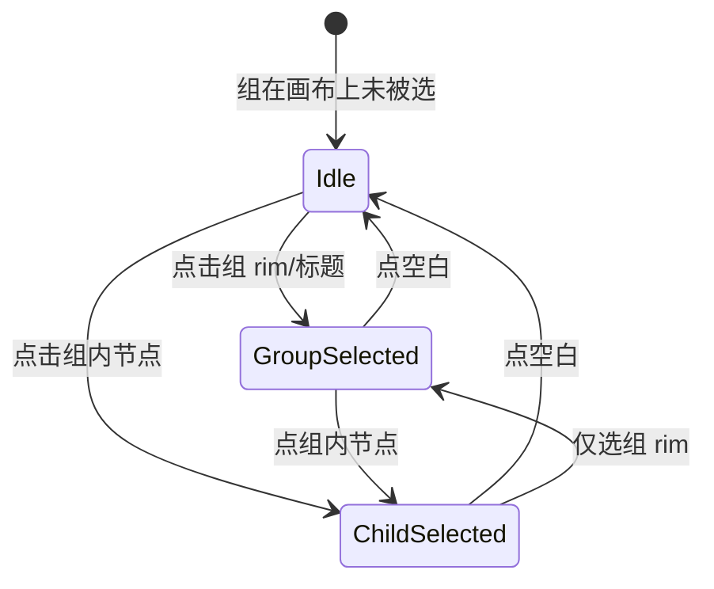

# 分组底板 UI 设计规范（Group Plate UI Spec）

> **状态**：设计稿（2026-05-21），**尚未开发落地**  
> **层级**：L0.5（介于画布 L0 与节点 L1 之间）  
> **关联**：[画布配色系统](./canvas-color-system.md) · [节点 Chrome 规范](../node-ui-spec/canvas-node-chrome-spec.md) · [打组产品方案](../product/画布打组功能方案.md)

---

## 1. 设计目标

| 目标 | 说明 |
|------|------|
| **层级正确** | 底板永远在**成员节点下方**，是「区域垫」，不是第二张节点卡 |
| **风格一致** | 色彩、描边、选中语义与全软件暗色炭黑体系一致，不单独搞一套「LibTV 浅蓝框」 |
| **语义可分** | 用户能区分：框选拖选（accent 蓝）、**已选中**组/节点（白描边）、组在运行——四种态不抢戏 |
| **单层视觉** | 仅一层填充 + 一层描边；禁止 border + inset 叠双圈、禁止 RF 外层再画底 |

**与现状差距（实现侧备忘，非本轮范围）**：

- 当前 `--cf-group-plate-*` 默认偏 accent 蓝、带渐变，易与 L1 节点壳、框选矩形「三套蓝」并存；
- 组选中曾用 accent 蓝描边，与 O-2「节点/组选中 = 白描边」不一致；
- 需按本文 token 重做，而非在现有渐变上微调。

---

## 2. 空间与层级（Z-Order）

```text
  Z 高 ↑
       │  节点外置标题 / GroupToolbar（Portal，屏幕固定 px）
       │  节点 L1 壳 #1A1A1A（不透明，可点、可连线）
       │  ─────────────────────────────────────
       │  L0.5 分组底板（半透明区域垫，pointer-events 仅 rim/标题）
       │  ─────────────────────────────────────
       │  L0 画布 #121212 + 点阵
       Z 低 ↓
```

| 规则 | 规范 |
|------|------|
| 底板与节点 | 子节点 `zIndex` 高于组父；底板**不**遮挡节点预览与锚点 |
| 标题位置 | 组外左上（与节点外置 meta 同思路），`top: -22px` 量级，**无**底色块 |
| 拖动手柄 | 整板 `groupNodePlateDrag` + 标题 + 四边 rim（`.groupNode__dragHandle`），拖动时子节点一体平移 |
| 缩放手柄 | 仅「组实体被选中」时四角 8×8px，`--cf-accent-focus` 填 + 白描边；**无**第二圈 resize 外框线 |

---

## 3. 色彩真源（与全站对齐）

原则摘自 [canvas-color-system.md](./canvas-color-system.md)：**小面积 accent** 仅用于框选/连线等「进行中」提示；**已选中**的组与节点统一 **白描边**（O-2）；idle 组用中性虚线 + 极低填充。

### 3.1 建议 Token（替代现行 `--cf-group-plate-*` 草案）

| Token | 值 | 角色 |
|-------|-----|------|
| `--cf-group-plate-fill` | `rgba(36, 36, 36, 0.72)` | 底板**灰色**填充（介于 L0 画布与 L1 节点之间） |
| `--cf-group-plate-border-idle` | `var(--cf-border)` | 未选中：虚线 **1px**，中性灰 |
| `--cf-group-plate-border-selected` | `var(--cf-border-strong)` | 选中组：**白描边**（与节点 O-2 一致） |
| `--cf-group-plate-border-selected-strong` | `rgba(255, 255, 255, 0.8)` | 可选；与 Chrome 节点 `selected` inline 对齐时使用 |
| `--cf-group-plate-title` | `var(--cf-soft-white-secondary)` | `#A8A6A3`，同节点外置次文 |
| `--cf-group-plate-title-selected` | `var(--cf-soft-white)` | 组选中时标题提亮 |
| `--cf-group-plate-radius` | `12px` | 与节点圆角体系协调（节点壳 8px，区域可略大） |

**实现默认**：组选中描边用 `--cf-group-plate-border-selected`（`0.14`）；若需与图片/视频节点选中一样「更亮」，可升为 `border-selected-strong`（`0.8`），但**禁止**改用 accent 蓝。

**删除或不再使用**：

- `--cf-group-plate-bg-top/bottom` 双色渐变（会像第二张 L1 卡片）；
- `--cf-group-plate-inset` 内描边（造成「双层框」）；
- 默认 idle 态 `rgba(107,155,209,0.4)` 虚线（accent 面积过大）。

### 3.2 选中语义（核心，已定稿）

| 用户操作 | 视觉主体 | 描边 | 填充 |
|----------|----------|------|------|
| **框选拖选**（多选进行中） | `.canvasMarqueeRect` | accent 蓝 `rgba(107,155,209,0.35)` 虚线 | `0.08` |
| **选中组实体**（点组 rim/标题） | L0.5 底板 | **白描边** `--cf-border-strong`，**1px 实线**（idle 为虚线） | `rgba(255,255,255,0.03)` |
| **选中组内节点** | L1 节点壳 | **白描边**（同 O-2 / Chrome selected） | 节点壳 `#1A1A1A` 实底 |
| **同时选中组+子节点** | 组底板 + 子节点 | **均为白描边**；组 idle→selected 与节点一致，不另加蓝框 |



**设计意图**：

- **框选拖选** = 临时、进行中 → **唯一**使用 accent 淡蓝矩形；
- **组选中** 与 **节点选中** = 已确认对象 → **统一白描边**（O-2），用户不必记两套选中色；
- 区分组 vs 节点靠 **层级**（底板在下、节点在上）与 **外置标题 / GroupToolbar**，不靠描边色相。

---

## 4. 分状态视觉规范

### 4.1 默认（Idle）

```
┌─ 分组 · 3 个节点 ─────────────  （外置标题，secondary 色）
│
│  ╭╌╌╌╌╌╌╌╌╌╌╌╌╌╌╌╌╌╌╌╌╌╌╌╌╮
│  ╎  [节点 A]    [节点 B]     ╎   ← L1 实底在上
│  ╎                            ╎
│  ╰╌╌╌╌╌╌╌╌╌╌╌╌╌╌╌╌╌╌╌╌╌╌╌╌╯
│     ↑ 1px 虚线 --cf-border，填充 2% 白
```

- 不抢节点对比度；缩略图/视频预览仍是视觉中心。
- 分镜组（`groupKind: storyboard`）：**仅标题**或标题旁 3px 色条用 `--cf-tone-script`（`#7EB892` 低饱和），底板仍用中性 idle，**不用**整板紫色渐变。

### 4.2 组选中（Group Selected）

- 描边：`1px solid var(--cf-group-plate-border-selected)`（白，`--cf-border-strong`）；相对 idle **虚线→实线**。
- 填充：`--cf-group-plate-fill-selected`（极弱白，非蓝）。
- 标题：`--cf-group-plate-title-selected`。
- 四角：resize 手柄 `--cf-accent-focus`（小面积 accent 仅在手柄）；**无**蓝框、无外发光。

### 4.3 组内节点选中（Children Selected）

- 子节点：白描边（与 §4.2 同族）。
- 底板：若**仅**子节点在选区、组实体未选中 → **4.1 Idle**；若组实体也在选区 → **4.2 白描边**（与节点并存，靠内外层级区分）。
- `GroupToolbar` 在组实体选中时出现；不因节点选中单独给底板加蓝框。

### 4.4 整组运行中（Run Aggregate）

| 聚合态 | 底板 | 标题区 |
|--------|------|--------|
| running | 描边 `--cf-accent-flow`，可选极弱脉冲（**仅描边**，不脉冲整块填充） | 徽章文案 + 蓝字，同 `groupRunBadge` |
| failed | 描边 `--cf-danger` 低饱和 | 红徽章 |
| succeeded | 描边 `--cf-success` 低饱和 | 绿徽章 |

运行态与组选中态叠加：**选中优先白描边**；运行语义靠标题区徽章 + 可选极弱描边脉冲，**不用** accent 蓝替代选中描边。

### 4.5 用户色标（Group Color Token）

- 作用：**小面积**——标题旁色点、或底板描边色（二选一，推荐描边 + 极弱 tint 填充顶色）。
- 色板来源：现有 `canvasGroupColors` 预设，饱和度 ≤ 节点左条色条。
- **禁止**：整板高饱和渐变背景（违反配色系统 §5）。

---

## 5. 排版与组件关系

| 元素 | 规范 |
|------|------|
| 标题文案 | `12px / 600`，「分组 · N 个节点」或分镜组专用文案；与 `nodeChrome-metaLabel` 同级 |
| 与 GroupToolbar | 工具条为 L2 浮层（`--cf-charcoal-elevated`），底板不承载按钮 |
| 与 MultiSelectionToolbar | 打组前多选条仍用现有 float 菜单皮；打组后仅 `GroupToolbar` |
| 圆角 | 底板 `12px`；节点 `8px`——区域略圆，形成「外框包裹内卡」层次 |

---

## 6. React Flow 外层约束

| 项 | 规范 |
|----|------|
| `.react-flow__node-group` | `background: transparent; border: none; box-shadow: none` |
| `node.style` | 仅 `width/height/borderRadius`；**不**写 `background` 渐变 |
| 视觉只画在 `.groupNodeRoot.groupNodeChrome` 一层 |

---

## 7. 与 LibTV 参考的差异（有意为之）

| LibTV 参考图 | CanvasFlow 设计 |
|--------------|-----------------|
| 浅色实线矩形 + 明显填充 | 暗色炭黑下**低对比**区域垫，填充 ≈ 2%–6% |
| 选中即粗框 | 组/节点选中均**白描边**；仅框选拖选过程用 accent 蓝 |
| 组与节点同权重 | 组永远在节点**下**，权重低于 L1 |

对齐的是**交互**（外置标题、rim 拖动、四角缩放、分组工具条），不是抄浅色 UI。

---

## 8. 实现阶段建议（供后续迭代单）

| 步骤 | 内容 | 验收 |
|------|------|------|
| P1 | 替换 token，idle 改中性虚线 + 单层填充 | 打组后仅见一圈虚线，无渐变「第二张卡」 |
| P2 | 组选中 = 白描边；框选仍为 accent 蓝；子节点选中同白描边 | 三种操作对比截图一致 |
| P3 | 分镜组 / 色标 / 运行态按 §4.4–4.5 | 不破坏 idle 中性基调 |
| P4 | 更新 `canvas-color-system.md` §L0.5 与 `global.css` 变量 | 文档与代码单真源 |

**Out of scope（本文）**：GroupToolbar 功能增删、嵌套组逻辑、Hermes 出图。

---

## 9. 手工验收（落地后）

1. 打组后底板在节点**下方**，拖动节点时底板随组移动，节点始终盖住底板边线内侧。
2. 未选中组：底板几乎看不见填充，仅淡虚线；节点 L1 清晰可读。
3. 只选中组：底板**白描边实线**，与选中节点视觉同族；**不是**框选蓝色。
4. 只选中组内节点：节点白描边；组底板 idle（除非组实体也在选区）。
5. 框选拖选仍为 accent 蓝；松手确认选中后，组/节点为白描边，二者不混色。
6. 选中组时仅有**一层**描边 + 四角手柄，无双线、无渐变「卡片感」。

---

## 10. 组框交互（缩放与拖入/拖出）

### 10.1 四角自由缩放

| 项 | 规范 |
|----|------|
| 触发 | 仅**组实体选中**时显示四角 `NodeResizer` 手柄 |
| 比例 | `keepAspectRatio: false`，宽高压扁独立可调 |
| 下限 | 不小于 `GROUP_MIN_WIDTH` × `GROUP_MIN_HEIGHT`，且**不小于**当前组内成员外接矩形 + `GROUP_CONTENT_PADDING` |
| 上限 | 无硬性上限（画布坐标内自由拉大） |
| 持久化 | `dimensions` 变更同步写入 `group.style.width/height` |
| 视觉 | 无第二圈 resize 外框线；手柄 `--cf-accent-focus` |

缩放组框**不**自动缩放/移动组内节点（成员保持相对坐标）；仅改变「活动区域」边界。

### 10.2 拖出组（Detach）

| 项 | 规范 |
|----|------|
| 手势 | 组内节点像普通节点一样拖动；**不**使用 `extent: parent` 锁在框内 |
| 判定 | **拖拽结束**时，以节点**中心点**是否仍在**直接父组**世界坐标包围盒内 |
| 移出 | 中心离开父组 → 提升一级：嵌套则挂到外层组，否则到画布顶层；**世界坐标不变** |
| 计数 | 外置标题「分组 · N 个节点」的 N = 直接 `parentId === groupId` 的子节点数，**立即减 1** |
| 空组 | 允许 0 个成员，不自动删组 |

### 10.3 拖入组（Attach）

| 项 | 规范 |
|----|------|
| 手势 | 画布顶层（或其它组外）节点拖入某组底板区域 |
| 判定 | 拖拽结束时中心点落在哪个组框内；嵌套组取**最内层**命中组 |
| 移入 | 设置 `parentId`，位置改为相对该组的坐标；**世界坐标不变** |
| 计数 | 目标组 N **立即加 1**；原父组若不同则 N 减 1 |
| 限制 | `type: group` 的节点不参与自动吸组（避免组壳被误吸进另一组）；禁止形成环 |

### 10.4 与选中态关系

- 拖入/拖出**不**改变「组选中 = 白描边」规则；
- 拖组 rim 仍整组平移；拖成员仅移动该成员（结束后才可能改 membership）。

---

## 11. 待决（Open）

| ID | 问题 | 状态 |
|----|------|------|
| G-1 | 组选中描边？ | **已定**：idle 中性虚线 / selected **白描边实线**（`--cf-border-strong`） |
| G-2 | 色标是否改变底板填充？ | 默认仅改描边；填充 tint ≤ 8% opacity |
| G-3 | 嵌套组外框是否加深？ | 内层组 idle 略深 1 档 `fill`，仍中性 |

---

*§10 拖入/出与缩放：`canvasGroupMembership.ts` + `onNodesChange`；§3–4 视觉落地仍待 `global.css` / `GroupNode` 白描边。*
