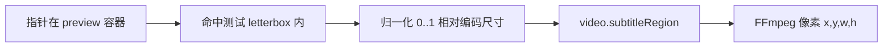

# 框选去字幕 — 实现方案设计

> **版本**：0.3（迭代 2 已交付 FFmpeg delogo）  
> **迭代 1**：2026-05-19 — 框选 UI、`video.subtitleRegion` 持久化、与裁剪互斥  
> **迭代 2**：2026-05-19 — `delogo_video_to_assets` +「应用去字幕」替换成片  
> **日期**：2026-05-19  
> **对齐**：LibTV 2.3 视频工具「智能去字幕 → 框选去除」、`video-node-chrome-phase2.md`  
> **关联实现**：`VideoMinimalPlayer` 裁剪模式、`videoTrimEditingNodeId`、`trim_video_to_assets`

---

## 1. 目标与边界

### 1.1 用户目标

用户在**已有成片**的视频节点上，在预览画面里**框住硬字幕区域**（常见为底部条），一键处理并得到**无该区域字幕**的新成片，尽量保持其余画面与运动不变。

### 1.2 与「自动去除」的差异

| 维度 | 自动去除（已实现入口） | 框选去除（本方案） |
|------|------------------------|-------------------|
| 用户输入 | 无区域，全画幅语义 | **显式矩形区域** |
| 处理路径 | 参考视频 + 提示词 → 视频模型重生成 | **优先本地 FFmpeg 区域修复**；可选远期 AI |
| 成本/时延 | 高（模型调用） | 低（本地） |
| 适用 | 字幕位置不固定、愿接受整段重绘 | 字幕位置固定、条带式硬字幕 |
| 风险 | 画面漂移、人物变形 | 区域模糊/涂抹感、静态 mask 无法跟动 |

两者应并存，顶栏同属「智能去字幕」菜单，不互相替代。

### 1.3 非目标（首版不做）

- 字幕 OCR 自动检测与跟踪（滚动字幕、多语言识别）
- 多段不同时间轴的不同区域（首版仅**全片统一矩形**）
- 画布底部 Dock、时间线级关键帧 mask
- 替换为云端 LibTV 专有去字幕 API（无文档前不假设）

---

## 2. 交互设计（对齐 Chrome + 裁剪模式）

### 2.1 入口

`VideoPreviewToolbar` → **智能去字幕 ▾** → **框选去除**

行为类比 **剪辑 → 单段裁剪**：

1. 校验节点已有 `path` / `assetId`
2. `canvasUiStore.videoSubtitleRegionEditingNodeId = nodeId`（与 `videoTrimEditingNodeId` 互斥）
3. 状态栏：`框选字幕区域：拖动框选底部条带，完成后点「应用去字幕」`
4. 取消选中节点 / Esc / 点「取消」→ 退出编辑态

### 2.2 预览区 UI（示意）

```text
┌─ 预览 (object-fit: contain) ─────────────────────────┐
│  ░░░░░░░░░░░░░░░░░░░░░░░░░░░░░░░░░░░░░░░░░░░░░░░░░  │
│  ░░░░░░░░░░░  正常画面  ░░░░░░░░░░░░░░░░░░░░░░░░░  │
│  ░░░░░░░░░░░░░░░░░░░░░░░░░░░░░░░░░░░░░░░░░░░░░░░░░  │
│  ┌──────────────────────────────────────────────┐  │
│  │  用户框选区（描边 + 半透明蒙层外暗化）          │  │
│  └──────────────────────────────────────────────┘  │
└────────────────────────────────────────────────────┘
  [ 应用去字幕 ]  [ 取消 ]     ← 预览条上方条带（同裁剪 TrimBar）
```

**控件**

- 初始框：默认 `y=0.82, h=0.14`（相对编码分辨率），宽 90% 居中，覆盖常见底字幕
- 拖拽：移动框；四角/四边：缩放（最小高度 ≥ 编码高度的 3%）
- 指针：`nodrag nopan`，事件 `stopPropagation`（与进度条、拖节点一致）
- 播放：裁剪模式下可继续播放，框**不随时间变化**（首版静态 mask）

### 2.3 处理中 / 结果

| 状态 | UI |
|------|-----|
| 处理中 | 预览区半透明遮罩 +「正在去字幕…」；禁用应用按钮 |
| 成功 | 替换节点 `path`/`assetId`（与 `exportVideoTrim` 一致），退出编辑态，状态栏显示输出文件名 |
| 失败 | 状态栏错误；保留框与编辑态，可重试 |

**结果策略（建议）**：默认**替换当前节点成片**并写入 `assets/`；高级选项「另存为新文件」可放二期。

---

## 3. 坐标系（核心难点）

### 3.1 为何要单独建模

预览 `<video>` 使用 `object-fit: contain`，DOM 矩形 ≠ 编码像素。框选必须持久化为**编码分辨率下的归一化坐标**，供 FFmpeg / 未来 API 使用。

### 3.2 数据定义

```ts
/** 相对编码帧：原点左上，取值 0..1 */
export type VideoSubtitleRegion = {
  x: number; // 左
  y: number; // 上
  w: number; // 宽
  h: number; // 高
};

// 存入 FlowNodeData.video
export type VideoNodePersisted = {
  // ...
  /** 框选去字幕：归一化区域（可持久化上次框） */
  subtitleRegion?: VideoSubtitleRegion;
  sourceWidth?: number;  // 与 sourceDurationSec 类似，metadata 回填
  sourceHeight?: number;
};
```

### 3.3 转换管线



**工具函数**（建议 `src/lib/videoPreviewGeometry.ts`）：

- `getVideoContentRect(containerRect, intrinsicW, intrinsicH)` → 实际画面区域
- `clientPointToNormalizedRegion(clientX, clientY, ...)` 
- `normalizedRegionToPixels(region, intrinsicW, intrinsicH)` → 整数像素，边界 clamp
- `normalizeVideoSubtitleRegion(region)` → 最小尺寸、限制在 [0,1]

单测覆盖：16:9 视频在 1:1 预览壳、超宽壳下的映射。

---

## 4. 处理管线（分阶段）

### 4.1 阶段 A — MVP（推荐首迭代）

**本地 FFmpeg `delogo` / `removelogo`**

| 项 | 说明 |
|----|------|
| 命令 | `ffmpeg -i in -vf "delogo=x:X:y:Y:w:W:h:H" -c:a copy out`（copy 失败则 AAC + libx264） |
| Tauri | `delogo_video_to_assets(project_path, video_rel_path, region_norm)`，模式对齐 `trim_video_to_assets` |
| 优点 | 离线、可预期、与 Tauri 工程资产流一致 |
| 缺点 | 涂抹/模糊；**无法**处理位置随时间变的字幕；复杂背景易穿帮 |

**诚实提示（应用前或设置旁）**

> 框选去字幕使用本地快速修复，适合底部固定条带字幕。滚动字幕或全屏动态文字请用「自动去除」或专业工具。

### 4.2 阶段 B — 增强（可选）

**区域条件视频重生成**

- 将 `subtitleRegion` 编码进提示词（如「去除画面下方约 15% 区域内的所有文字」）+ 参考视频
- 或：导出 mask 视频（区域外黑/白）作为第二路参考（若模型支持）
- 依赖 Settings 中视频模型能力与费用，不作为 MVP 阻塞项

### 4.3 阶段 C — 远期

- 关键帧 OCR + 跟踪框
- 专用去字幕供应商 API（Volc / 即梦等）一旦有 mask 输入文档再对接

---

## 5. 前端架构

### 5.1 状态拆分

| 状态 | 存放 | 说明 |
|------|------|------|
| 是否正在框选 | `canvasUiStore.videoSubtitleRegionEditingNodeId` | 瞬态 UI |
| 矩形数据 | `data.video.subtitleRegion` | 持久化，重开工程可恢复框 |
| 编码宽高 | `data.video.sourceWidth/Height` | `onLoadedMetadata` 写入 |
| 与裁剪互斥 | 进入框选时清空 `videoTrimEditingNodeId`，反之亦然 | 避免两套 overlay |

### 5.2 组件职责

| 模块 | 职责 |
|------|------|
| `VideoSubtitleRegionOverlay.tsx` | 蒙层 + 可拖拽选框（纯 UI，接收 normalized region + callbacks） |
| `VideoChromePreview.tsx` | 组合 Player + Overlay；挂载 TrimBar 同类 `SubtitleRegionBar` |
| `videoSubtitleRegion.ts` | 归一化、默认框、像素换算 |
| `videoToolbarSubtitle.ts` | `invoke('delogo_video_to_assets', ...)` |
| `projectStore` | `enterVideoSubtitleRegionMode` / `patchVideoSubtitleRegion` / `applyVideoSubtitleRegion` |
| `VideoPreviewToolbar.tsx` | `subtitle-region` → enter mode |

**不**把框选逻辑塞进 `VideoMinimalPlayer`，与播放条解耦（同裁剪条在 Player 外层的做法）。

### 5.3 顶栏 action 配置

```ts
// videoPreviewToolbarActions.ts — 行为已是 menu，无需改结构
{ id: "subtitle-region", label: "框选去除", mode: "subtitle-region" }
```

---

## 6. 后端（Rust）

### 6.1 命令签名（草案）

```rust
#[tauri::command]
pub fn delogo_video_to_assets(
    app: AppHandle,
    project_path: String,
    video_rel_path: String,
    region: DelogoRegion, // { x, y, w, h } 归一化 f64
) -> Result<ImportedMediaItem, String>
```

实现要点：

1. `probe` 或使用前端传入的 `sourceWidth/Height`（以前端为准，后端 ffprobe 校验可选）
2. 像素：`x = (region.x * W).round()` 等，保证 `x+w <= W`, `y+h <= H`
3. 输出 `assets/video-delogo-{stem}-{ts}.mp4`，`upsert_asset` kind `video`
4. 错误：区域过小、ffmpeg 失败、文件不存在

可放在现有 `video_tools_cmd.rs`，与 `trim_video_to_assets` 共用 `escape_ffmpeg_path` / `run_ffmpeg`。

### 6.2 性能

- 长视频全片 delogo 耗时线性；首版可接受，状态栏显示进行中
- 二期：仅处理「有字幕」时间段需时间轴，首版不做

---

## 7. 推荐迭代拆分（符合低复杂度规则）

### 迭代 1 — 框选 UI + 持久化（无处理）

- **层**：CanvasExperienceLayer  
- **模块**：`videoPreviewGeometry`、`VideoSubtitleRegionOverlay`、`canvasUiStore`、`VideoChromePreview`  
- **验收**：能框选、拖动、缩放；保存工程再打开框仍在；与裁剪模式互斥  
- **不做**：FFmpeg、替换成片  

### 迭代 2 — FFmpeg 导出

- **层**：CanvasExperienceLayer + ProviderOrchestrationLayer（本地）  
- **模块**：`video_tools_cmd::delogo_video_to_assets`、`projectStore.applyVideoSubtitleRegion`  
- **验收**：Tauri 下应用后节点视频更新且可播放；取消/失败可重试  
- **不做**：AI 重生成、多区域、跟踪  

### 迭代 3（可选）— 体验抛光

- 最近使用框比例记忆、快捷键 Enter 应用  
- 与 `subtitle-auto` 互跳提示  
- 质量对比：delogo vs 模型 A/B（设置开关）

---

## 8. 验收步骤（迭代 2 完成后）

1. Tauri 打开工程，视频节点有成片 → **框选去除** → 出现默认底部框，可拖角缩放。  
2. 播放视频，框位置不随时间漂移（符合预期）。  
3. **应用去字幕** → 等待完成 → 成片字幕带消失或明显减弱，画外区域无明显破坏。  
4. 保存并重开工程 → 框选数据仍在；再次应用可重复。  
5. 与**单段裁剪**交替进入，无双重 overlay、无拖节点误触。  
6. 浏览器 `npm run dev`：提示「请在桌面端使用」（与裁剪一致）。

---

## 9. 风险与回退

| 风险 | 缓解 |
|------|------|
| letterbox 算错导致 delogo 偏位 | 单测 + 处理前预览框与 FFmpeg 叠一层调试开关（仅 dev） |
| delogo 质量用户不满 | 文案引导用「自动去除」；二期接 AI |
| 滚动字幕无效 | 首版文档与 UI 明确「静态区域」 |
| 与 GPU/编解码器兼容性 | copy 失败走 x264 回退（同 trim） |

**回退**：隐藏 `subtitle-region` 菜单项或 feature flag；保留 `subtitleRegion` 字段不破坏旧工程。

---

## 10. 与现有代码的衔接点

| 已有能力 | 复用方式 |
|----------|----------|
| `videoTrimEditingNodeId` | 复制「单节点编辑态」模式 |
| `trim_video_to_assets` | 同样 `ImportedMediaItem`、替换 `path`/`assetId` |
| `VIDEO_SUBTITLE_PROMPT_SEED` | 仅用于 `subtitle-auto`，框选不走 draft |
| `applyNoSubtitlePrompt` | 生成时无字幕，与后期去字幕互补 |
| `VideoPreviewToolbar` menu | `runMenuOption` 增加 `subtitle-region` 分支 |

---

## 11. 决策记录（待评审）

| # | 问题 | 建议默认 | 备选 |
|---|------|----------|------|
| D1 | MVP 算法 | FFmpeg delogo | 直接上模型 |
| D2 | 区域数量 | 单矩形 | 多矩形列表 |
| D3 | 结果 | 替换节点成片 | 总是新节点 |
| D4 | 默认框 | 底部 14% 居中 90% 宽 | 全屏需用户拖 |
| D5 | 与裁剪同时 | 互斥 | 允许叠加 |

---

*评审通过后：更新 `video-node-chrome-phase2.md` 第 4 节，并将迭代 1 写入 `docs/iterations/` 执行单。*
