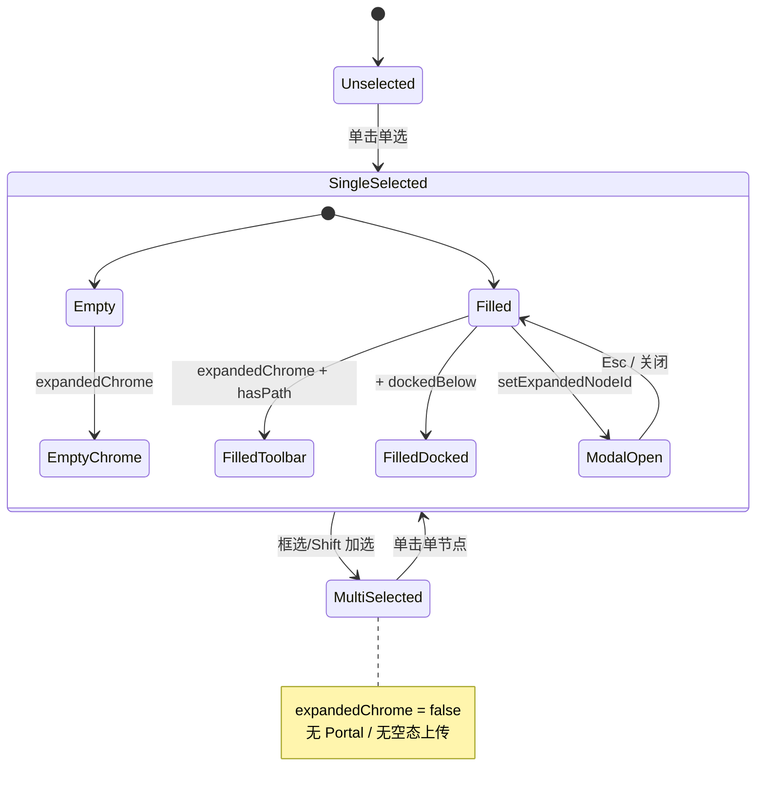

# 画布节点 Chrome 设计规范（Canvas Node Chrome Spec）

> **版本**：1.3  
> **状态**：现行（以代码为准）  
> **基准实现**：`imageNode` → `MinimalImageNode`  
> **更新日期**：2026-05-19  
> **关联文档**：`README.md`（React Flow 通用约定）、`docs/superpowers/specs/2026-05-13-unified-image-node-design.md`（历史合并方案，部分已过时）

本文档描述 **LibTV 极简媒体节点** 的可复用 UI / 交互体系，用于将图片节点设计风格迁移到视频、音频、文本等节点。**实现与本文冲突时，以 `src/` 中标注了本规范的代码为准；改行为须同步更新本文。**

---

## 1. 设计目标

| 目标 | 说明 |
|------|------|
| 画布内缩放 vs 屏幕固定 | 节点预览区随 ReactFlow 缩放；工具条、生成面板用 Portal + `position: fixed`，保持可读与可点 |
| 壳与能力分离 | 节点本体 = 预览/内容 + 锚点；能力 = 外部顶栏 / 底栏 / 居中 Modal |
| 选中才展开 | 未选中紧凑；**单选**选中才显示扩展 Chrome（见 §5.1） |
| 无内容 / 有内容两态 | 空态引导上传 + 底栏生成；有内容态顶栏操作 + 底栏可隐藏 |
| 元信息外置 | 名称、分辨率/进度放在节点边框**外**左上/右上，无底色块 |
| 弱装饰 | 深灰底、细描边；选中时边框提亮，不用粗蓝外发光 |

---

## 2. 空间分层

```text
                    ┌─ 顶栏 Portal（固定 px，锚 preview 上缘）────────┐
                    │  分组 Chip 工具条（有内容 + 单选选中）            │
                    └──────────────────────────────────────────────────┘
  左上：标签（外置 top:-18）              右上：分辨率 | 生成中 N%
  无内容时：节点上方居中「上传」浮动按钮（仅选中）
┌─ 节点壳 .minimal-image-node（随画布缩放）────────────────────────────┐
│  ┌─ .minimal-image-preview（锚点 ref，仅媒体/占位）────────────────┐ │
│  │  有图：NodeMediaPreview  │  无图：占位 SVG                      │ │
│  └────────────────────────────────────────────────────────────────┘ │
│  ⊕ SimpleAnchors（左输入 / 右输出）                                  │
└────────────────────────────────────────────────────────────────────┘
                    ┌─ 底栏 Portal（宽 500px，锚 preview 下缘）────────┐
                    │  ImageGenerationPanel（空态更高 / 默认 / 展开）   │
                    └──────────────────────────────────────────────────┘

  展开 Modal：ImageGenerationPanelExpandedModal（居中，非 NodeMaximizedOverlay）
```

### 2.1 与旧 `NodeFrame` 模式对比

| 能力 | Chrome 模式（图片节点） | NodeFrame 模式（视频/文本等） |
|------|------------------------|------------------------------|
| 标题 | 外置左上，透明 | 卡内标题行 + 图标 |
| 顶栏能力 | `ImagePreviewToolbarPortal` | 多为内嵌或 `floatingTopOverlay` |
| 底栏生成 | `ImageGenerationPanelPortal` | `floatingBottomOverlay` 内嵌 |
| 锚点 | `NodeAnchors` `variant="simple"` | 多为 `MagneticNodeAnchors` |

**迁移方向**：新媒体类节点优先 Chrome 模式；文本/脚本保留卡内编辑，仅将「生成/模型」迁到底栏 Portal。

---

## 3. 设计 Token

定义于 `src/components/nodes/MinimalImageNode.css`（`:root` 与 `.imageNodeChrome--minimal`）。

### 3.1 颜色

| Token | 值 | 用途 |
|-------|-----|------|
| `--bg-canvas` | `#121212` | 画布背景 |
| `--bg-node` | `#1E1E1E` | 节点壳、面板底 |
| `--bg-panel` | `#1A1A1A` | 浮层面板 |
| `--bg-button` | `#252525` | Chip、次要按钮 |
| `--border-node` | `rgba(255,255,255,0.12)` | 默认边框 |
| `--border-node-selected` | `rgba(255,255,255,0.8)` | 选中边框（inline 亦可） |
| `--text-primary` | `#E0E0E0` | 主文案 |
| `--text-secondary` | `#9E9E9E` | 次要文案 |
| `--text-placeholder` | `#616161` | 占位图标色 |
| 外置分辨率 | `rgba(255,255,255,0.28)` | `.minimal-image-res-dims` |
| 生成进度 | `rgba(147,197,253,0.95)` | `.minimal-image-gen-progress` |

### 3.2 圆角与尺寸

| Token | 值 |
|-------|-----|
| `--radius-sm` | `6px` |
| `--radius-md` | `8px` |
| `--radius-node` | `8px`（节点壳） |
| `--chrome-panel-width` | `500px`（`GEN_PANEL_CHROME_WIDTH`） |
| `--chrome-panel-gap` | `12px`（`GEN_PANEL_CHROME_GAP`） |
| `--chrome-above-extra` | `28px`（`GEN_PANEL_CHROME_ABOVE_EXTRA`，为外置标签留空） |
| `--chrome-z` | `40`（`GEN_PANEL_CHROME_Z`） |
| 生成按钮 | `36×36px`，白底 `#FFF`，圆角 `8px` |
| Simple 锚点 | `gap 6px`，旋钮直径 `18px`（`--simple-anchor-knob`） |

### 3.3 CSS 类命名（现行）

| 类名 | 含义 |
|------|------|
| `imageNodeChrome--minimal` | 底栏/顶栏/Modal 共用深色面板皮肤 |
| `imageNodeChrome--top` | 顶栏外壳（胶囊 + 横向滚动） |
| `imageGenPanel--minimal` | 生成面板内容区 |
| `igp-layout-empty` / `default` / `expanded` | 底栏三种布局高度与结构 |
| `minimal-image-node` | 节点壳（**迁移时可泛化为 `nodeChrome-shell`**） |
| `minimal-image-preview` | 预览锚点区（**`nodeChrome-preview`**） |

> **命名演进**：迭代 A 计划将 `imageNodeChrome--*` 别名保留，新增中性前缀 `nodeChrome--*`，避免视频节点仍叫 `image*`。

### 3.4 节点壳尺寸（图片）

定义于 `src/lib/imageGeneration/imageAspectSize.ts`：

| 常量 | 值 | 说明 |
|------|-----|------|
| `IMAGE_NODE_MAX_EDGE` | `500` | 预览框长边上限（随画布缩放） |
| `IMAGE_NODE_MIN_EDGE` | `96` | 短边下限 |
| 比例来源 | `resolveImageNodeFrameRatio` | 优先 `outputParams.aspect`；`auto` 时用实图 `imageWidth/Height` |
| 计算 | `computeImageNodeFrameSize(ratio)` | 长边 ≤ maxEdge，保持成片比例 |

**迁移视频节点时**：播放器壳应对齐同一套「长边 cap + 比例一致」思路，数值可独立定义（如 `VIDEO_NODE_MAX_EDGE`）。

### 3.5 间距与排版（Chrome 常用）

| 项 | 值 |
|----|-----|
| 外置标签/状态 | `top: -18px`；左 `4px` / 右 `4px` |
| 顶栏 Chip 字号 | `12px` |
| 顶栏胶囊底 | `rgba(26,26,26,0.88)` + `backdrop-filter: blur(8px)` |
| 顶栏菜单下拉 | `top: calc(100% + 4px)`，`z-index: 20`（相对顶栏容器） |
| 空态占位 SVG | `clamp(56px, 20%, 88px)`，`opacity ~0.22` |
| 空态上传浮动钮 | `.minimal-image-upload-float`，节点上方居中 |

---

## 4. 核心模块与文件

| 模块 | 路径 | 职责 |
|------|------|------|
| 共享模块 | `nodeChrome/` | `NodeChromeShell`、`NodeMetaLabel`、`NodeMetaStatus`、Token/Shell CSS |
| 节点壳 | `MinimalImageNode.tsx` | 布局、显隐、组合 nodeChrome 组件 |
| 节点样式 | `MinimalImageNode.css` | 图片专用（工具条、生成面板 IGP） |
| 共享样式 | `nodeChrome/nodeChromeTokens.css`、`nodeChromeShell.css` | Token + 壳/元信息/Portal 皮肤 |
| 顶栏 Portal | `ImagePreviewToolbarPortal.tsx` | `placement: "above"` |
| 顶栏内容 | `ImagePreviewToolbar.tsx` | 分组 Chip、菜单 |
| 顶栏配置 | `lib/imagePreviewToolbarActions.ts` | 分组 actions 数据驱动 |
| 底栏 Portal | `ImageGenerationPanelPortal.tsx` | `placement: "below"` |
| 底栏内容 | `ImageGenerationPanel.tsx` | 提示词、模型、生成钮 |
| 展开 Modal | `ImageGenerationPanelExpandedModal.tsx` | 居中放大编辑 |
| 空态上传 | `ImageNodeEmptyUpload.tsx` | 选中无图时节点上方居中 |
| 定位 Hook | `hooks/useNodeGenerationChrome.ts` | rAF 跟踪锚点矩形 |
| 选中展开 | `hooks/useNodeExpandedChrome.ts` | 多选/拖拽 suppress（**图片节点已接入**） |
| 双击聚焦 | `hooks/canvas/useFocusMediaNodeViewport.ts` | 图片/视频 200% + 居中 |
| 视频节点 | `MinimalVideoNode.tsx` | 迭代 B 基准实现 |
| 锚点 | `anchors/SimpleAnchors.tsx` | 磁吸 + 菜单 |
| 进度 | `lib/nodeAgentRuntime/imageGenProgress.ts` | 8%→92% ticker |
| Agent 进度 | `hooks/useNodeStatus.ts` | 全局 `node-agent-event` → `data.status` |
| UI 状态 | `store/canvasUiStore.ts` | `imageGenPanelExpandedNodeId`、`imageGenPanelPinnedNodeId` |
| 画布分工 | `canvas/NodeSelectionToolbar.tsx` | 图片节点 return null（不叠通用工具条） |
| 上游参考图 | `lib/imageGeneration/collectIncomingImageRefs.ts` | 含 `imageNode` / 历史 `imageAsset` |
| 遗留 | `ImageAssetNode.tsx` | 未注册 `nodeTypes`，勿作新功能入口 |

---

## 5. 显隐与状态机

### 5.1 全局：何时显示扩展 Chrome

```ts
// useNodeExpandedChrome.ts
expandedChrome = selected && !nodeDragSuppressUi && !multiSelect
```

- **多选**（含框选、Shift 加选）：所有节点保持紧凑，不显示底栏/顶栏 Portal。  
- **拖拽节点**：`nodeDragSuppressUi` 为 true 时 suppress。  
- **图片节点**：`MinimalImageNode` 已接入；局部条件与 `expandedChrome` **AND**（见 §5.2）。

### 5.2 图片节点局部（`MinimalImageNode`）

```ts
expandedChrome = useNodeExpandedChrome(selected).expandedChrome
hasPath = Boolean(path || assetId)
dockedBelow = genPanelPinned || pinnedGenPanelId === id
showGenPanel = expandedChrome && (!hasPath || dockedBelow) && expandedGenPanelId !== id
showPreviewToolbar = expandedChrome && hasPath
showEmptyUpload = expandedChrome && !hasPath
```

**两层关系**：`expandedChrome`（全局单选） **AND** 上表局部条件，缺一不可。

| 状态 | 顶栏 | 底栏 | 空态上传 |
|------|------|------|----------|
| 未选中 | 隐藏 | 隐藏 | 隐藏 |
| 选中、无图 | 隐藏 | **显示**（empty layout） | **显示** |
| 选中、有图 | **显示** | 隐藏（除非钉住） | 隐藏 |
| 选中、有图、钉住 | 显示 | **显示**（default layout） | 隐藏 |
| 展开 Modal 打开 | 按上 | 底栏 Portal 隐藏（`expandedGenPanelId === id`） | — |

**钉住**：底栏「钉住」→ `setImageGenPanelPinnedNodeId`（**全局唯一**）；单选其它节点时，原节点失选会清钉住。  
**从顶栏打开底栏**：`onOpenGenPanel` → 本地 `genPanelPinned`（仅当前选中会话有效）。

### 5.3 右上角元信息

- 有分辨率且非生成中：显示 `宽×高`（优先 `naturalWidth/Height`，否则 `data.imageWidth/Height`）。  
- 生成中：`data.status.status === "running"` 且 `progress` 为数字 → `生成中 N%`（优先于分辨率）。  
- 生成结束或取消：清除 `status`，恢复分辨率。

### 5.4 生成进度（非真实 API 进度）

- Agent 阶段事件 + `startImageGenProgressTicker` 在 execute 段平滑推进。  
- 后端无逐帧回调前，**禁止**在 UI 文案中写「实时 API 进度」。  
- 取消生成：停止 ticker + `updateNodeData(id, { status: undefined })`。

### 5.5 Z 轴层级（新增浮层时参照）

| 层级 | z-index | 组件 |
|------|---------|------|
| 画布 overlay 基线 | 10–12 | 拖放 overlay、选区框 |
| 节点外置标签/状态 | 2 | `minimal-image-label`、`-top-right` |
| 节点内局部 UI | 5–20 | 预览内控件、顶栏 Chip 下拉 |
| **Chrome Portal** | **40** | `GEN_PANEL_CHROME_Z`（顶栏 + 底栏） |
| 画布工具条 | 45 | `NodeSelectionToolbar`、`MultiSelectionToolbar` |
| **展开 Modal** | **55** | `ImageGenerationPanelExpandedModal` |
| 锚点菜单 | 120 | `anchorMenuPlacement` |
| 连接提示 | 130 | `FlowConnectHint` |
| 预设/Slash 面板 | 1000+ | `SlashPresetPanel`、部分 IGP 上浮菜单 |

> 新浮层应高于 Chrome（40）且低于 Slash（1000），或复用现有常量。**禁止**随意用 `9999` 盖掉全局菜单。

---

## 6. 交互规范

### 6.1 画布级

| 操作 | 行为 | 实现参考 |
|------|------|----------|
| 双击 `imageNode` | 画布 zoom **2.0**，节点居中，`duration 420ms` | `FlowCanvas` → `focusImageNodeAt200` |
| 双击 ≠ 展开底栏 | 展开参数用顶栏「放大预览」或面板展开钮 | 勿绑到 `setImageGenPanelExpandedNodeId` |
| 单击选中 | 标准 ReactFlow 选中 | — |
| 点击画布空白 | 失焦输入、清选区 | 节点内 `pointerdown` 监听 |

### 6.2 节点内

| 操作 | 行为 |
|------|------|
| 点击外置标签 | 进入编辑；Enter 提交；Esc 撤销 |
| 标签 `pointerdown` | `stopPropagation`（避免拖动画布） |
| 选中时点击 Portal 外 | 清除选区、blur 焦点（`panelRef` + `toolbarRef` 除外） |
| Delete / Backspace | 非输入框时删除选中节点 |
| 预览区 | 默认 `pointer-events: none`；交互子区域单独 `auto` |

### 6.3 顶栏工具条

- 结构：**分组** + 组内横向滚动 + 组间竖线分隔。  
- 动作类型：`preset` | `edit` | `utility` | `stub`（stub 显示 toast，不静默失败）。  
- 配置：`IMAGE_PREVIEW_TOOLBAR_GROUPS`（新节点复制结构，改 id/label/actions）。  
- 事件：`stopPropagation` on `pointerdown` / `click`。

### 6.4 底栏生成面板

| layout | min-height 量级 | 特征 |
|--------|-----------------|------|
| `empty` | ~180px+ | 顶行风格/标记图标；大占位提示词 |
| `default` | ~180px | 标准参数行 + 生成钮 |
| `expanded` | Modal 内 | 大输入区；与 Portal 共用 `ImageGenerationPanel` |

- 生成钮：空闲 ↑ 箭头；运行中 ■ 停止（`IgpGenerateButtonIcon`）。  
- 模型/画幅：上浮菜单，避免原生 `<select>` 堆叠。  
- **不要**恢复：红褐色提示条、底栏「T」图标、字数「0」、「约¥0.03」等已移除元素。

### 6.5 锚点（SimpleAnchors）

| 参数 | 值 |
|------|-----|
| 边距 | `SIMPLE_ANCHOR_EDGE_GAP = 6` |
| 磁吸半径 | `SIMPLE_ANCHOR_MAGNET_RADIUS = 44` |
| 光标 | 十字 / 准星（磁吸态） |
| 非磁吸 | CSS 定位 resting |
| 磁吸 | inline style 跟随指针 |

媒体类节点统一 `variant="simple"`；复杂排版节点可暂保留 `magnetic`。

### 6.6 Portal 定位（禁止项）

```ts
// useNodeGenerationChrome.ts
x = rect.left + rect.width / 2
chromeW = panelRef.current?.offsetWidth ?? panelWidth  // 必须用真实宽度
x = clamp(x, chromeW/2 + 8, window.innerWidth - chromeW/2 - 8)
```

- **禁止**将 `panelWidth` 设为 `window.innerWidth - 16`（会导致顶栏不跟随节点）。  
- **禁止**用近全屏宽度做水平钳制。  
- `placement: "above"` 时额外减去 `GEN_PANEL_CHROME_ABOVE_EXTRA`。

### 6.7 平台与环境限制

| 场景 | 行为 |
|------|------|
| Tauri 桌面 | 空态上传、文件导入、生成 API 全功能 |
| 浏览器 `npm run dev` | `ImageNodeEmptyUpload` 内 `isTauri()` 为 false → **上传钮无操作**；布局预览可用 |
| 验收 | 浏览器模式不崩溃；上传能力需在 Tauri 下测 |

### 6.8 与画布其它 UI 的分工

| 组件 | 与图片节点关系 |
|------|----------------|
| `NodeSelectionToolbar` | `imageNode` 时 **return null**（复制/删除等由节点内键盘处理） |
| `NodeMaximizedOverlay` | 图片生成 **不用**；用 `ImageGenerationPanelExpandedModal` |
| `MultiSelectionToolbar` | 多选时出现；与 Chrome suppress 并存 |

### 6.9 Esc 与焦点优先级

| 上下文 | Esc 行为 |
|--------|----------|
| 展开 Modal 打开 | 关闭 Modal（`setImageGenPanelExpandedNodeId(null)`），**保持节点选中** |
| 节点选中、编辑标签 | 撤销标签编辑 |
| 节点选中、无 Modal | 清选区 / blur 焦点（不关选中） |
| 底栏/顶栏 Portal 内输入 | 优先由输入组件消费 |

### 6.10 底栏输入与 Agent

- **输入**：`MentionInput` 支持 `/` 预设、`@` 主体引用。  
- **顶栏 preset**：写 prompt 并触发生成（`imagePreviewToolbarActions`）。  
- **Agent**：`runNodeTaskAgent` → `node-agent-event` → `useNodeStatusListener` → `data.status`。  
- **image_edit**：顶栏编辑类 action → `resolveImageGenerationContext` → `imageGenerationAgent`。

### 6.11 视频底栏生成面板（`videoGenPanel--chrome`）

| 项 | 约定 |
|----|------|
| 容器 | `VideoMultimodalInputPanel` + `layout="portal"\|"expanded"`；类名 `videoGenPanel--chrome`（`NODE_CHROME_VIDEO_PANEL_CLASS`） |
| 宽度 | Portal / 展开 Modal 均为 **500px**（`vgp-layout-expanded` 仅增高字号） |
| 创作模式 Tab | **只读**：`mmTab--inactive` + `pointer-events: none`；由上游连线 `detectVideoWorkflow` 决定，不可手点切换 |
| 参考图 | 无参考时不渲染 `mmThumbsWrapper`（禁止「暂无参考图」占位） |
| 模型 | Chrome 底栏用 `VideoModelPicker`（Portal 上浮菜单，`VIDEO_MODEL_MENU_Z = 1200`）；非 Chrome 保留原生 `mmModelSelect` |
| 输出参数 | `mmOutputCombo` pill，内容宽度（`--vgp-control-*` token） |
| 生成钮 | 复用 `igp-generate-btn` 三态：可生成 / 禁用 / 生成中（`--vgp-cta-*`）；失败可点重试，成功显示勾选并禁用 |
| 提示词 | `vgp-prompt-wrap` + 右下角 `vgp-prompt-counter`；无白描边，与面板一体 |
| Token | `--vgp-control-*`、`--vgp-cta-*` 定义于 `.videoGenPanel--chrome`（`MinimalVideoNode.css`） |

---

## 7. 迁移到其它节点

### 7.1 推荐矩阵

| 节点 type | 壳内容 | 顶栏（有内容+单选） | 底栏 | 外置元信息 | 锚点 | 双击聚焦 |
|-----------|--------|---------------------|------|------------|------|----------|
| `imageNode` ✅ | 图预览 | 预览工具条 | 文/图生图 | 标签+分辨率/进度 | simple | 200% |
| `videoNode` ✅ | 播放器/封面 | 预览工具条（LibTV 2.3：剪辑/高清/解析/去字幕/音频分离；stub+菜单） | VideoMultimodal Portal | 外置标签 `视频 N`+右上分辨率/进度 | simple | 200% |
| `audioNode` | 波形 | TTS/导出 | TTS 面板 | 标签+时长 | simple | 可选 |
| `textNode` | 摘要/折叠 | 同步/复制 | Composer | 标签+字数 | magnetic→simple 可选 | 可选 |
| `scriptNode` | 分镜预览 | 生成/导出 | Script 工作台 | 标签+镜头数 | magnetic | 可选 |
| `llm` | 对话摘要 | 清空/导出 | Prompt | 标签 | magnetic | 可选 |

### 7.2 不宜硬套

- **文本/脚本**：正文宜保留在卡内可编辑；只 Portal 化「生成/模型」区。  
- **视频**：播放控件必须内嵌；顶栏仅放生成类操作。  
- **分组 / FFmpeg**：复用 Token + 生成钮即可，不必双 Portal。

### 7.3 迁移检查清单（每个节点）

- [ ] `previewRef` 仅包裹媒体/占位，工具条不在其内部  
- [ ] 顶/底栏使用 `useNodeGenerationChrome`，`panelWidth` 默认 500  
- [ ] 多选时不显示 Portal（`expandedChrome` via `useNodeExpandedChrome`）  
- [ ] 空态上传在节点**上方**外部，非预览内大块遮罩  
- [ ] 生成进度写 `data.status`，右上外置显示  
- [ ] 顶栏 actions 数据驱动（独立 `*ToolbarActions.ts`）  
- [ ] 双击行为与产品确认（聚焦 vs 展开）  
- [ ] 改 UI 后更新本文 §4–§6

---

## 8. 实施迭代（建议顺序）

| 迭代 | 范围 | 产出 |
|------|------|------|
| **A** ✅ | 设计系统抽离 | `src/components/nodes/nodeChrome/`、`chromeClassNames.ts`；图片节点已接入 |
| **B** ✅ | `videoNode` | `MinimalVideoNode` + 顶/底 Portal + SimpleAnchors |
| **C** | 音频 / 文本 / 脚本 | 按 §7.1 矩阵分批 |

**Out of scope（各迭代通用）**

- 后端真实进度 WebSocket  
- 内顶栏 + 右上嵌入上传（图二方案，除非产品重开）  
- 统一删除 `NodeFrame`（长期并存）

**回滚**：恢复节点 type 映射到旧组件；`canvasUiStore` 字段可保留不用。

---

## 9. 手动验收（图片节点回归）

1. 无图单选：见上方上传钮 + 底栏 empty；双击画布 zoom 200% 且节点居中。  
2. 有图单选：见顶栏分组工具条，底栏默认隐藏；钉住后底栏出现。  
3. 拖动画布：顶/底栏跟随节点，不漂在视口中央。  
4. 框选多选：顶/底栏均不出现。  
5. 生成中：右上「生成中 N%」；取消后恢复分辨率。  
6. 顶栏「放大预览」：打开居中 Modal，非双击触发。  
7. **浏览器模式**：无 Tauri 时上传无操作，页面不报错。  
8. **多选**：框选 2+ 图片节点时顶/底栏、空态上传均不出现。  
9. **钉住**：钉住 A 后单选 B，A 失选时 `pinnedGenPanelId` 清除。  
10. **展开 Modal**：打开时底栏 Portal 隐藏；Esc 只关 Modal。  
11. **顶栏 stub**：点占位项有 toast，不静默。  
12. **锚点**：拖线、磁吸、菜单弹出时不误拖节点。

---

## 10. 文档维护约定

1. **改 Chrome 行为** → 同一 PR 更新本文对应章节。  
2. **新增节点 type** → 在 §7.1 矩阵加一行 + 新建 `*ToolbarActions.ts` 说明。  
3. **Token 变更** → 更新 §3 并注明 CSS 文件行号或变量名。  
4. 历史 spec `2026-05-13-unified-image-node-design.md` 仅作背景；冲突以本文 + `MinimalImageNode` 为准。

---

## 附录 A：顶栏分组（图片）

见 `src/lib/imagePreviewToolbarActions.ts`：`general` | `grid` | `imageEdit` | `tools`。

## 附录 B：`canvasUiStore` 字段

| 字段 | 用途 |
|------|------|
| `imageGenPanelExpandedNodeId` | 居中展开 Modal 时隐藏底栏 Portal |
| `imageGenPanelPinnedNodeId` | 有图时钉住底栏 |

## 附录 C：相关 Hooks 签名

```ts
useNodeGenerationChrome(anchorRef, { active, panelWidth?, placement?: "below" | "above" })
useNodeExpandedChrome(selected) → { expandedChrome, suppressExpandedUi, multiSelect }
focusImageNodeAt200(reactFlowInstance, nodeId) // useFocusImageNodeViewport.ts
```

## 附录 D：`FlowNodeData` 与 Chrome 相关字段

| 字段 | 用途 |
|------|------|
| `label` | 外置左上标题 |
| `path` / `assetId` | 是否有内容（`hasPath`） |
| `imageWidth` / `imageHeight` | 右上分辨率、画幅 ratio |
| `params` | 画幅/模型等（`readImageOutputParams`） |
| `status` | `{ status: "running", progress?: number }` 生成进度 |

## 附录 E：与 README v3（React Flow 通用）的优先级

- **Chrome Spec 优先**于 README 中的选中蓝 glow（`rgba(99,102,241)`）示例。  
- 图片节点选中：**白描边** `rgba(255,255,255,0.8)`，不用 React Flow 默认 indigo 外发光。  
- Handle 隐藏策略：Simple 锚点自管 DOM，不依赖 `.react-flow__handle` 默认样式。

## 附录 F：显隐状态组合（图片）



---

*维护者：Canvas 体验层迭代。有疑问先查 `MinimalImageNode.tsx` 再改本文。*
