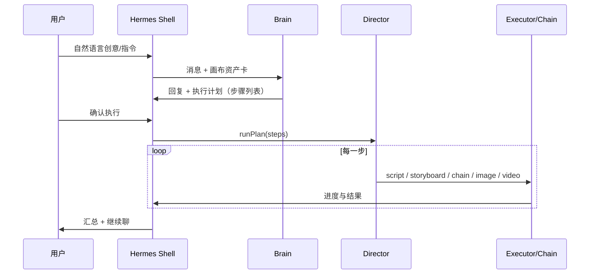

# Hermes — 内置智能体（产品架构）

> **北极星**：Hermes 是 CanvasFlow **主窗口内嵌的创作导演**——文字或素材启动，经**创意碰撞 → 大纲 → 视觉化 → 调整 → 成片**五阶段，由对话驱动 Director 调用画布节点完成生成；**不需要 @ 画布节点**（可用 **@ 已上传参考素材**）。  
> 完整用户流程见 [`HERMES_CREATIVE_WORKFLOW.md`](HERMES_CREATIVE_WORKFLOW.md)。  
> **灵体愿景与 Octo 对标**见 [`HERMES_SPIRIT_VISION.md`](HERMES_SPIRIT_VISION.md)（智能体下一阶段母文档）。
> **Cursor-style Agent 完整产品规格**见 [`HERMES_CURSOR_AGENT_SPEC.md`](./HERMES_CURSOR_AGENT_SPEC.md)（六维能力、Job 队列、记忆、设置、路线图）。  
> 形态：画布内 **H 浮窗**（对话）+ 收起时的 **灵体 Orb**；**不独立部署、不监听端口**。  
> 与 **Hermes Chain**（建链/批量出图）同属执行层，由 **Hermes Director（编排）** 在对话识别意图后**自动执行**，而非两套产品。

### 交互原则（2026-05-26 确认）

- **不提供制片控制台**：无创作阶段标签、参考素材条、任务轨、计划确认卡等需用户点击的制片 UI。
- **唯一操作面是对话**：用户说创意或指令；Hermes 规划并**自动执行**；进度用对话气泡反馈（`▶ / ✓ / ✗`）。
- **唯一审核点是画布**：用户在节点/成片上看结果；不满意则**继续对话**或**在节点上手改**（节点手改不经过 Hermes 面板按钮）。

---

## 1. 用户看到的两种形态

| 形态 | 行为 |
|------|------|
| **展开（Active）** | 画布内可拖动的 **H 浮窗**：仅对话区 + 输入区；识别到可执行意图后自动跑 Director，无「执行计划」按钮 |
| **收起（Idle）** | 画布内可拖拽的 **灵体 Orb**；点击展开浮窗 |

**原则**：没有第二个窗口、没有 `localhost:3xxx` 配置项、没有「打开 Hermes 网页」。

---

## 2. 三个子系统（命名固定，避免混谈）

```
┌─────────────────────────────────────────────────────────────┐
│  App Shell（Tauri 单进程）                                    │
│  ┌──────────┬────────────────────────────┬───────────────┐ │
│  │ 工作区菜单 │         FlowCanvas          │ Hermes Shell  │ │
│  │ + Tab    │         （画布 SSOT）          │ 展开 / 收起    │ │
│  └──────────┴────────────────────────────┴───────────────┘ │
│         ▲                    ▲                    ▲          │
│         │                    │                    │          │
│   projectStore         nodeAgentRuntime      Hermes Brain    │
│   canvasflow.json        （执行生成）          （对话 + 规划）  │
│         │                    ▲                    │          │
│         │                    │    Hermes Director（编排）   │
│         └────────────────────┴────────────────────┘          │
│         Hermes Chain（可被 Director 调用，也可分镜后自动触发）   │
└─────────────────────────────────────────────────────────────┘
                              │
                    设置 → 模型（已有 Provider）
                    invoke → Rust LLM（同进程）
```

| 子系统 | 代码现状 | 职责 |
|--------|----------|------|
| **Hermes Chain** | ✅ `src/lib/hermes/autoChain.ts` 等 | 分镜完成后建 image/video、批量出图、分镜状态回写；**确定性编排**，不是聊天 |
| **Hermes Brain** | ✅ Phase B | 流式对话、资产卡上下文、`hermes_enhance` |
| **Hermes Director** | ✅ Phase C | 对话 → **计划** → **自动执行** → 调 Executor |
| **Hermes Shell** | ✅ Phase A | 浮窗 + Idle 灵体（纯对话壳） |

**分工**：

- **Brain**：听懂你在聊什么（创意、改镜、问答），必要时产出结构化**计划**。
- **Director**：把计划落成对现有 Agent/Chain 的调用序列（**不 @ 节点**；可参考会话素材）。
- **nodeAgentRuntime / Chain**：真正生成并写回画布（与手动点节点按钮同一路径）。

---

## 3. 全本地一体化（技术约束）

| 约束 | 实现方式 |
|------|----------|
| 不独立部署 | 无 Hermes 微服务；所有逻辑在 **Tauri 主进程 + WebView** |
| 不开端口 | 不启动 HTTP server；前端仅 `invoke` Tauri command |
| LLM 调用 | 复用 **设置 → 模型** 已配置的 Provider（OpenAI 兼容 / 即梦 CLI 仅用于出图，Copilot 用 chat 类 Provider） |
| 上下文存储 | **画布即记忆**：`nodes` / `edges` / `scriptNode.data`；对话历史 `localStorage` 按 **`projectPath + 画布 TabId`** 分桶（切换 Tab/工程自动换记录），**不进** `pipeline_sessions` 表 |
| 流式输出 | `hermes_chat_stream` → Tauri event → Shell 增量渲染（同进程 IPC，非 SSE 外网） |
| 离线 | 无网时 Shell 仍可打开，显示「未配置模型」；Chain 中需 API 的步骤照常失败并提示 |

**明确不做**：Docker 侧车、本地 Ollama 专用端口（除非未来作为「又一种 Provider」接入设置页，仍不走 Hermes 专用端口）。

---

## 4. Shell 信息架构

### 4.1 浮窗结构（唯一 Shell）

```
┌ H · 智能体 ───────────────────────────── [收起] ┐
│ 对话区（用户 / Hermes 气泡；流式 + 执行进度行）      │
├──────────────────────────────────────────────┤
│ 输入框（自然语言）                    [发送]   │
└──────────────────────────────────────────────┘
```

无参考素材条、任务轨、计划卡、阶段标签；能力由对话触发（见 `hermesSkills.ts` / Director 工具表）。

**Shell 对话指令**（规则识别，非 LLM）：`清空对话` / `新对话` 仅清**当前 Tab** 的聊天记录；`对话存在哪` / `当前对话范围` 说明分桶归属。画布节点与任务进度不因清空对话而删除。

**意图三分流（iter-43）**：`consult` 走**顾问模式**（电影通识、片单、理论，专用 prompt + `film-literacy` 知识）；`execute` 走 Director 自动执行；`mixed` 计划气泡先含风格/理论摘要再跑步骤。默认无制片关键词时按咨询处理，避免误触发出图。

**全自动跑片（iter-44）**：说「全自动跑片 / 一键出片 / 全流程」等触发模板 `full-auto-export`（梗概→…→导出 mp4）；大批量默认免「继续」确认；每步成功写入工程断点，失败后可说「继续跑片」。可说「关闭全自动」恢复批量确认。

**自主影视 Agent（iter-45）**：详见 [`HERMES_AUTONOMOUS_AGENT.md`](HERMES_AUTONOMOUS_AGENT.md) — 工程记忆、用户 Skills、Canvas MCP 指挥节点、并行子 Agent、工程内定时自动化；通用知识仍来自**设置 → 模型 → 文本**大模型。

### 4.2 上下文：对话 + 画布 + 参考素材

| 信息来源 | 用途 |
|----------|------|
| **全画布资产卡** | script、分镜、已出图/视频 |
| **对话历史** | 氛围、镜号、阶段意图（渐进明确） |
| **Hermes 参考素材** | 上传图/音/文档；对话内 **@素材名** 指向 `assets/`（Phase D） |
| **每步执行结果** | 进入下一轮对话与计划 |

不必 `@画布节点`。说「第 3 镜」「帮分镜出图」即可；说「参考刚上传的霓虹街景」用 **@素材**（非 @节点）。

### 4.3 Idle 灵体（对齐图二）

- 位置：`canvasUiStore.hermesDock`（`edge: right-bottom`，`x/y` 偏移）。
- 交互：单击 → 展开 Shell；拖拽 → 仅移动灵体；长按 → 可选快捷菜单（新对话 / 打开设置）。
- 动画：呼吸光晕；有 **未读建议** 或 **Chain 需要关注**（如自动建链失败）时外圈提示点。
- **不**在 Idle 态跑 LLM，零后台轮询。

### 4.4 布局接入点

当前 `App.tsx`：

```tsx
<div className="mainSplit">
  <FlowCanvas />
</div>
```

目标：

```tsx
<div className="mainSplit">
  <FlowCanvas />
  <HermesShell />  {/* 展开：侧栏；收起：仅 Portal 灵体 */}
</div>
```

侧栏宽度可拖（默认 360px），收起时不占 `mainSplit` 宽度。

---

## 5. Director：对话如何驱动节点（目标态）



| 用户说法（示例） | Director 典型步骤 |
|------------------|-------------------|
| 「做个 30 秒短片，雨夜女主回头」 | 建 script → 写 brief → 生成分镜 →（确认后）建链出图 |
| 「分镜已经有了，帮出图」 | 检查就绪镜 → `chain` 或 `batchGenerateImages` |
| 「第 2 镜改成夜景再出一张」 | 改 shot visual → 对该镜 `image.generate` |
| 「先聊聊，别生成」 | 仅 Brain 回复，无 plan |

**与 Chain 自动触发的关系**：

- 设置里 Hermes Chain **仍可**在分镜 Agent 结束时自动建链（无人对话时省事）。
- 对话里说的「出图」走 **Director 确认后** 调用同一套 `handleScriptNodeCompleted` / 批量出图，避免重复执行需做幂等（计划里先 `canvas.summarize` 看是否已有节点）。

**执行默认**：识别到 Director 计划后**立即执行全部步骤**；计划在对话中列出，进度以 `▶/✓/✗` 行反馈；用户在画布审核结果。

**设置 → 常规 → Hermes**：说明对话自动执行原则；**计划模板**在设置中**只读查阅**，增删改在 H 对话（「有哪些模板」「保存模板为…」「删除模板…」）。

### 5.1 Director 工具表（当前实现）

| toolId | 说明 |
|--------|------|
| `canvas.ensure_script` | 创建脚本节点 |
| `script.update_brief` | 写入创意梗概 |
| `script.generate_outline` | 生成镜头大纲 |
| `script.generate_storyboard` | 生成分镜文案 |
| `storyboard.patch_shot` | 改单镜词；可选再出图/视频 |
| `canvas.focus` | 定位镜头（fit 节点 / 脚本全屏） |
| `canvas.summarize` | 制片状态摘要（真读画布） |
| `bible.update` | 更新项目圣经 |
| `chain.spawn_media_nodes` | 建链 image/video 节点 |
| `image.generate_for_beats` | 批量关键帧出图 |
| `video.generate_for_beats` | 批量视频生成 |
| `video.retry_failed` | 重试失败视频镜头 |
| `film.workflow_check` | 流程/断链检查 |
| `film.shot_to_video_prompt` | 写入 Seedance 视频提示词 |
| `film.batch_set_video_params` | 批量视频参数 |
| `film.create_standard_workflow` | 标准工作流拓扑 |
| `compose.export_script` | 合成时间线并导出 |
| `template.run` | **仅规划阶段**：展开为模板内步骤 |

话术示例：「跑模板 分镜出关键帧」「有哪些计划模板」「第 3 镜改成夜景再出图」。

### 5.2 进度反馈

不向用户展示任务轨面板；`node-agent-event` 仍供灵体 Orb 建议等内部逻辑。批量进度写入**对话气泡**（如 `▶ 批量出图（镜 3）…`）。

---

## 6. 分阶段交付（建议迭代顺序）

### Phase A — Shell 空壳（无 LLM）

- `HermesShell` 展开/收起 + Idle 灵体 + `canvasUiStore` 状态持久化（仅 UI 位置）。
- 快捷技能占位；输入框本地 echo。
- **验收**：无端口；刷新后灵体位置保留；与画布快捷键不冲突。

### Phase B — Brain MVP（Enhance + 单轮流式 Chat）

- Rust：`hermes_agent.rs` + `hermes_enhance` + `hermes_chat_stream`（Tauri event）。
- 前端：`assetCards.ts` + Shell 对话区接流。
- **验收**：断网外服情况下仅配置本地 Provider 也能对话；对话不写 `canvasflow.json` 除非用户点「应用」。

### Phase C — Director 对话编排 ✅

- `hermesDirector`：规则 + LLM 混合规划、工具执行器。
- 浮窗：对话内计划摘要 + 自动执行进度（无确认卡）。
- 见 §5.1 工具表；迭代 [`iteration-23`](../iterations/iteration-23-hermes-orchestrator.md)～[`iteration-38`](../iterations/iteration-38-hermes-plan-templates.md)。

### Phase D — 素材与并行 ✅（主体）

- 会话 **@素材**（对话内引用 `assets/`，无上传条 UI）。
- **计划模板**（内置 5 + 自定义，设置页管理；对话触发）。
- iter-40：**对话唯一入口**，移除计划确认卡与制片侧栏块。

### Phase E — 成片一键

- Director 触发时间线合成与导出（复用 Compose / FFmpeg）。

---

## 7. 与「工程 / 画布 Tab」的关系

- **工程**：磁盘真相；Hermes 对话历史键 = `projectPath`（未保存则为临时草稿桶）。
- **画布 Tab**：每个 Tab **独立** 对话记录；切换 Tab 会加载该 Tab 自己的历史，**不会**把 A Tab 的聊天带到 B Tab。右上角模型 HUD 第二行显示当前 `工程 · Tab` 归属。
- Hermes **不**因切换 Tab 自动关；切换前若侧栏有未发送草稿可提示（v2）。
- **一剧多集**：长期应在 **同一工程** 下多画布文件；Shell 技能「新建分集」引导「保存工程 + 新 Tab」，而不是另起 Hermes 服务。

---

## 8. 非目标（北极星下明确排除）

- 独立 Hermes 安装包、浏览器插件、Electron 第二窗口  
- 默认云端 Hermes API（除非用户自己在 Provider 里填第三方 URL）  
- 用 Hermes 替代 `nodeAgentRuntime` 直接出图  
- v1 无人值守跑完全片（与 iteration-13 一致）

---

## 9. 文档与代码索引

| 文档 | 说明 |
|------|------|
| 本文 | 产品北极星 + Shell/Brain/Chain 分工 |
| [`HERMES_CREATIVE_WORKFLOW.md`](HERMES_CREATIVE_WORKFLOW.md) | 五阶段工作流、启动方式、高级技巧对照 |
| `docs/superpowers/specs/2026-05-07-hermes-auto-chain-design.md` | Chain 旧稿（触发 agent 名已改为分镜 Agent） |
| `docs/iterations/iteration-13-hermes-auto-chain-policy.md` | Chain 策略 ✅ |
| `docs/hermes-pipeline-agent-plan.md` | Brain 实现手册 v4（待按 Phase B 裁剪合入） |
| `docs/hermes-v4-review.md` | 方案与代码差异审查 |

| 代码 | 说明 |
|------|------|
| `src/lib/hermes/autoChain.ts` | Chain 监听 |
| `src/lib/hermes/hermesDirector.ts` | 规划与执行 |
| `src/lib/hermes/hermesPlanTemplates.ts` | 计划模板 |
| `src/lib/hermes/hermesDirectorPrefs.ts` | 导演偏好 |
| `src/components/hermes/HermesSidebar.tsx` | Shell 侧栏 |
| `src-tauri/src/executor/hermes_agent.rs` | Brain 流式 |

---

## 10. 进度

| 阶段 | 状态 |
|------|------|
| Phase A Shell 空壳 | ✅ [`iteration-21-hermes-shell.md`](../iterations/iteration-21-hermes-shell.md) |
| Phase B Brain MVP | ✅ [`iteration-22-hermes-brain-mvp.md`](../iterations/iteration-22-hermes-brain-mvp.md) |
| Phase C Director（对话驱动节点，无 @ 节点） | ✅ [`iteration-23-hermes-orchestrator.md`](../iterations/iteration-23-hermes-orchestrator.md) |
| Phase D 参考素材 @ + 创作阶段 | ✅ [`iteration-24-hermes-ref-assets.md`](../iterations/iteration-24-hermes-ref-assets.md) |
| Phase E 成片导出（Director） | ✅ [`iteration-25-hermes-compose-export.md`](../iterations/iteration-25-hermes-compose-export.md) |

**Phase A 入口**：画布灵体 · 展开 H 浮窗 · `Ctrl+Shift+H` · 代码 `src/components/hermes/`。  
**iter-40**：[`iteration-40-hermes-conversation-only.md`](../iterations/iteration-40-hermes-conversation-only.md)  
**iter-41**：[`iteration-41-hermes-smart-execute.md`](../iterations/iteration-41-hermes-smart-execute.md)（LLM 规划增强 · 批量对话确认 · 失败重试 · 模板对话）  
**iter-42**：[`iteration-42-roadmap.md`](../iterations/iteration-42-roadmap.md)（42-1～42-3 ✅ 失败修复 · 参考素材对话 · 设置模板只读）
