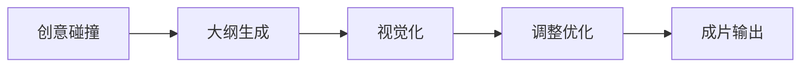

# Hermes 创作工作流（产品对照）

> 将「文字启动 + 素材参考 + 五阶段成片」映射到 CanvasFlow 内置 Hermes 与现有画布生产链路。  
> 总架构见 [`HERMES.md`](HERMES.md)。

---

## 1. 启动方式

| 方式 | 用户怎么做 | 产品实现 | 状态 |
|------|------------|----------|------|
| **文字启动** | 在 Hermes 对话框输入，如「我想创作一个关于未来城市的科幻短剧」 | `HermesSidebar` 流式对话 → Brain 理解意图 → Director 出计划 | ✅ 对话 · 📋 自动执行 |
| **素材上传** | 拖拽/上传图片、音频、文档等到对话或画布 | 画布拖入 → `import_media_files` 进工程 `assets/`；Hermes 侧栏 **参考素材区**（计划）可挂到本轮对话 | ✅ 画布导入 · 📋 Hermes 附件条 |

**两种启动可并存**：先丢参考图再打字，或先聊创意再补素材。

---

## 2. 五阶段创作流程



### 阶段 1 — 创意碰撞

| 项 | 说明 |
|----|------|
| **目标** | 多轮对话，把方向从模糊聊到可执行 |
| **Hermes 行为** | 仅 Brain：追问时长、基调、角色、禁忌；**不**立刻跑 API |
| **画布** | 可选自动建 `textNode` / `scriptNode` 草稿，写入 `prompt` 摘要 |
| **用户技巧：渐进明确法** | 先「科幻短剧 + 未来城市」，再补「5 镜、冷色调、无台词」— 对话历史即上下文 |
| **用户技巧：氛围描述法** | 「黄昏暖光」「雨夜忧郁」— Brain 记入后续大纲/分镜 prompt |
| **状态** | ✅ 对话 · 📋 自动写 script 摘要 |

### 阶段 2 — 大纲生成

| 项 | 说明 |
|----|------|
| **目标** | 故事大纲 + 角色/场景设定 |
| **Hermes 行为** | Director 计划示例：`script.update_brief` →（可选）`script.parse` 节拍 |
| **画布落点** | `scriptNode.data.prompt`、`scriptBeats[]`（场次/角色/描述） |
| **触发语示例** | 「根据我们聊的，生成大纲和主要角色」 |
| **状态** | 📋 Director · 部分能力在脚本工作台已有 |

### 阶段 3 — 视觉化

| 项 | 说明 |
|----|------|
| **目标** | 文字 → 分镜表 + 关键帧（图），必要时视频预览 |
| **Hermes 行为** | `script.generate_storyboard` → `chain.spawn_media_nodes` → `image.generate_for_beats` |
| **画布落点** | `storyboardShots[]`、image/video 节点、`assets/` |
| **触发语示例** | 「把大纲做成分镜并出关键帧」 |
| **与 Chain** | 分镜 Agent 完成后也可按设置自动建链；对话路径走 Director 确认 |
| **状态** | ✅ 分镜/出图 Agent · 📋 由 Hermes 一键串起 |

### 阶段 4 — 调整优化

| 项 | 说明 |
|----|------|
| **目标** | 改某一镜、改氛围、重出图/重出视频，快速迭代 |
| **Hermes 行为** | 解析「第 2 镜」「夜景」→ 改 `storyboardShots` / 节点 prompt → 单镜 `image.generate` 或 `video.generate` |
| **画布** | 用户仍可在节点上手动改；Hermes 与手动 **同一条** Agent 路径 |
| **触发语示例** | 「第 3 镜改成雨夜霓虹，重新出图」 |
| **状态** | ✅ `storyboard.patch_shot` + `canvas.focus` · ✅ 单节点手动生成 |

### 阶段 5 — 成片输出

| 项 | 说明 |
|----|------|
| **目标** | 一键合成完整短片，多格式导出 |
| **Hermes 行为** | Director：`timeline.concat` / 打开合成编辑器；导出走工程 `assets` + FFmpeg |
| **画布落点** | `ffmpegConcat` / Compose 时间线、导出路径 |
| **触发语示例** | 「按分镜顺序合成 30 秒成片并导出 mp4」 |
| **状态** | ✅ 合成/导出能力在画布 · 📋 Hermes 触发入口 |

---

## 3. 高级技巧 ↔ 产品设计

| 技巧 | 在 Hermes 里怎么做 | 与 @ 的关系 |
|------|-------------------|-------------|
| **氛围描述法** | 写在对话里；Director 写入分镜 `visualPrompt` / 图节点 prompt | 无需 @ |
| **参考指向法** | 上传素材后，在对话中说「参考**素材 A** 的色调」；计划阶段用 **会话内 @素材**（见下） | ✅ **@ 参考素材**，❌ 不 @ 画布节点 |
| **渐进明确法** | 默认多轮仅聊天；用户说「可以开始了」再出执行计划 | 无 @ |
| **并行任务处理** | 出图/出视频后台跑时，对话仍可聊下一镜；侧栏显示任务条（计划） | 无 @ |
| **批量素材准备** | 工程 `assets/` + 左侧资产；Hermes 可列出本轮可用参考 | 可选 @素材名 |
| **模板化工作流** | 保存「科幻短剧 5 镜」类 **Director 计划模板**（计划） | 无 @ |

### 两种「@」务必区分

| 类型 | 用途 | 是否采用 |
|------|------|----------|
| **Hermes 会话 @素材** | 指向本轮对话已上传/已选中的 `assets/xxx.jpg` | ✅ 计划采用（Phase D） |
| **画布节点 @** | 在视频节点 prompt 里 `@图1`（Seedance） | 保留在节点内，**不是** Hermes 输入方式 |
| **画布节点 @（Hermes）** | 在对话框 `@scriptNode-xxx` | ❌ 不做 |

---

## 4. 侧栏信息架构（目标）

```
┌ Hermes ─────────────────────────────────────┐
│ 工程名 · 当前阶段：视觉化                      │
├─────────────────────────────────────────────┤
│ [参考素材]  thumb thumb doc  （拖入 + @ 用）   │
├─────────────────────────────────────────────┤
│ 对话流（阶段标签可选）                         │
├─────────────────────────────────────────────┤
│ 【执行计划】 1.生成分镜 2.出关键帧  [执行]     │
├─────────────────────────────────────────────┤
│ 输入：未来城市科幻短剧…  [仅聊] [发送]          │
└─────────────────────────────────────────────┘
```

---

## 5. 实现路线图（与 Phase 对齐）

| 能力 | Phase |
|------|-------|
| 灵体 + 侧栏 + 流式对话 | A + B ✅ |
| 对话 → 计划 → 确认 → 分镜/出图 | C [`iteration-23`](../iterations/iteration-23-hermes-orchestrator.md) |
| Hermes 附件条 + 会话 @素材 | D |
| 后台任务条 + 计划模板 | D / E |
| 一键合成导出入口 | C 或 D（`timeline` 工具） |

---

## 6. 示例：从一句话到成片（理想路径）

1. 用户：「我想创作一个关于未来城市的科幻短剧」→ **创意碰撞**（3～5 轮）。  
2. 用户：「可以了，帮我出大纲」→ **大纲** 写入 scriptNode。  
3. 用户：「做分镜并出关键帧，冷色赛博」→ **视觉化** 计划 → 确认 → 分镜 + 出图。  
4. 用户：「第 2 镜参考上传的那张霓虹街景」→ **@素材** + 重出第 2 镜。  
5. 用户：「合成 30 秒 mp4」→ **成片** 走时间线/导出。

全程：**一个工程、一个 Hermes、画布可见每一步产物**；不另开网页、不新开端口。
