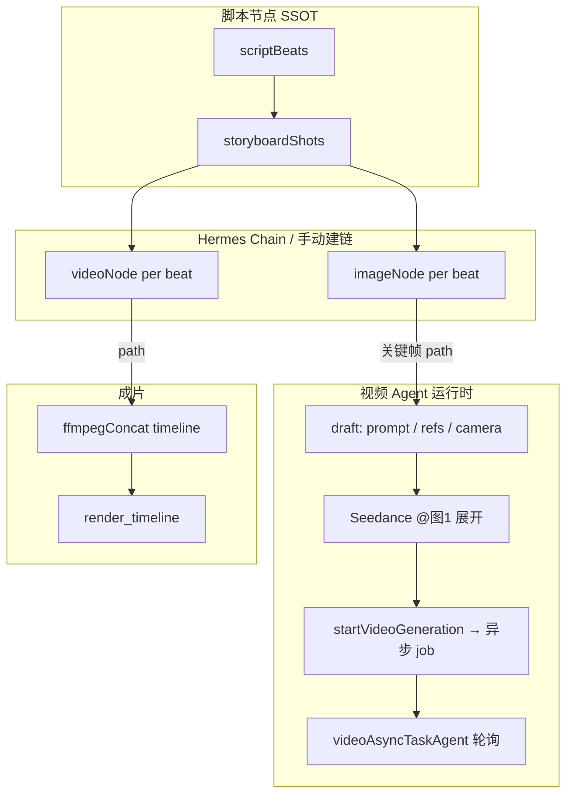

# Hermes 灵体方案（对标即梦 Octo · 视频 Agent · 用户需求）

> **文档性质**：产品 + 技术愿景（非单轮迭代单）。  
> **读者**：产品、前端、Agent/后端、设计。  
> **关联**：[HERMES.md](./HERMES.md) · [HERMES_CREATIVE_WORKFLOW.md](./HERMES_CREATIVE_WORKFLOW.md) · [LIBTV_GUIDE_ALIGNMENT.md](./LIBTV_GUIDE_ALIGNMENT.md)  
> **⚠️ 实现对照**：本文大量「现状」写于 **iter-25 前后**；iter-26～105 已交付视频工具、Job 中心、LLM 规划、语音、workstate 指代等。读 Octo 对标与 gap 时请先查 **[HERMES_SPIRIT_VISION_ERRATA.md](./HERMES_SPIRIT_VISION_ERRATA.md)**（2026-05-29）及 [HERMES_CURSOR_AGENT_SPEC.md](./HERMES_CURSOR_AGENT_SPEC.md)。

---

## 0. 结论先行：灵体不是什么、应该是什么

| 今天（Phase A–E） | 目标「灵体」 |
|-----------------|--------------|
| 侧栏聊天 + 规则型 Director + 确认后调现有 Agent | **常驻创作合伙人**：能感知你在画布上做什么，在合适时机主动提议，并**并行**推进多步生产 |
| Brain 主要「问答 + 资产卡摘要」 | **共感（Vibe）**：记得项目人设/风格/禁忌，对话与执行一致 |
| 计划靠关键词匹配 | **LLM 规划 + 世界模型**：理解缺口（缺角色图？缺第 2 镜视频？）再出可执行 DAG |
| 几乎不碰视频 Agent | **视频是一等公民**：分镜图 → 镜头视频 → 合成，由灵体统一调度 Seedance/方舟 |
| 用户仍要懂节点、工程、设置 | **用户只需叙事**：灵体把复杂度藏在节点图里，画布可展开「手术模式」 |

**一句话**：灵体 = CanvasFlow 的 **Octo 式交互层** + 本仓库已有的 **节点 Agent 执行层** + **本地工程 SSOT**；智能来自「感知 + 记忆 + 规划 + 并行任务」，而不是多开一个聊天窗口。

---

## 1. 为什么你会觉得「完全不够智能」

当前实现（截至 iteration 25）诚实状态：

| 能力 | 现状 | 用户感受 |
|------|------|----------|
| 创意碰撞 | 有流式对话，无结构化「提案卡」 | 像通用 ChatGPT，不像「懂短片」 |
| 规划 | `buildDirectorPlan` **规则/关键词** | 说法稍变就匹配不到；无法解释「为什么先做 A 后做 B」 |
| 执行 | 逐步调工具，失败即停 | 不会自动重试、不会「缺视频就先帮你排队出视频」 |
| 感知 | 仅全图资产卡 + 单选节点摘要 | **看不到**你刚拖了图、刚改了第 3 镜、刚失败的任务 |
| 并行 | 无任务中心 | 出图时不能边聊边改大纲；对标 Octo「边聊边生成」差距大 |
| 多模态 | 参考图 @ 已钉选；无语音/文档剧本深度解析 | Octo 可主动用图/音碰撞；我们仍偏「你先说清」 |
| 视频 | Director **无** `video.generate_for_beats` | 用户说「出片」往往卡在「只有图没有视频」 |
| 角色一致性 | 无「角色库 / 主体 ID」 | Octo 强调核心资产；我们有 scriptBeat 字段但灵体不运营 |
| 主动度 | Idle 灵体仅呼吸光晕 | 不会在「分镜完成」「3 镜失败」时 **主动** 提示 |

**根因**：我们完成了 **Shell + 薄 Director 胶水**，尚未建设 **认知层（记忆/感知/规划模型）** 与 **运营层（任务、资产、一致性）**。  
即梦 Octo 的差异不在「有没有 LLM」，而在 **产品默认你正在做叙事短片，且 UI 与 Agent 同屏共感**。

---

## 2. 对标：即梦 Octo（小章鱼）在做什么

> 公开信息（2026-04 内测报道）归纳，非官方 API 文档。

### 2.1 Octo 的产品承诺（Vibe Create）

1. **创意合伙人**，不是工单式「你下指令我交货」  
2. **对话 + 多模态同屏**：Agent 可用图片/音频参与讨论  
3. **感知界面与操作**：实时知道你在看什么、改了什么  
4. **异步并行**：边聊边生成，多任务同时进行  
5. **全流程闭环**：大纲 → 核心资产 → 剧本分镜 → 短片成片  
6. **模型一体**：Seedance 2.0（视频）+ Seedream 5.0 Lite（图）等，无需用户自己拼 API  

### 2.2 Octo vs 当前 Hermes（能力矩阵）

| 维度 | Octo（目标态） | Hermes 今天 | CanvasFlow 可差异化 |
|------|----------------|-------------|---------------------|
| 部署 | 即梦 Web 云 | Tauri 本地单进程 | 工程/素材在本地、可离线编辑、可接私有模型 |
| 画布 | 产品内画布（细节未公开） | React Flow **显式节点图** | 专业用户要「可编排、可复现、可导出节点」 |
| 规划 | Agent 内置（推测 LLM + 工具） | 规则 Director | 规则作兜底，LLM 作主规划 |
| 感知 | 强 UI 感知 | 弱（资产卡快照） | 可订阅 `projectStore` / 选中 / Agent 事件 |
| 并行 | 产品级任务队列 | 无统一队列 | `node-agent-event` + 任务中心即可复用 |
| 视频 | 深度联动 Seedance | 节点内有，灵体未编排 | 同一 `videoGenerationAgent`，灵体补编排 |
| 资产记忆 | 角色/场景/道具整理 | scriptBeats + assets/ | **项目圣经（Bible）** + 节点绑定 |
| @ 引用 | 多模态素材 | @ 参考素材（Phase D） | 保留节点内 `@图1`（Seedance），灵体 @ 会话素材 |
| 成片 | 产品内导出 | ffmpegConcat + Hermes 触发 | 时间线可手调，灵体负责「建议与一键」 |

### 2.3 应对策略：不抄壳，抄「关系」

- **学 Octo**：共感、并行、阶段感、少 `@` 节点 ID。  
- **不丢 CanvasFlow**：节点图是 **真相与可审计性**；灵体是 **驾驶舱**，不是替代画布。  
- **本地优先**：Octo 绑定即梦账号；我们绑定 **工程 + 设置里的 Provider/即梦 CLI**，灵体负责 **编排与解释**。

---

## 3. 用户是谁、真正要什么

### 3.1 核心 personas

| Persona | 目标 | 耐心 | 对灵体的期望 |
|---------|------|------|--------------|
| **叙事短视频作者** | 60s 内讲清一个故事 | 低 | 「我说氛围，你帮我把镜都出了」 |
| **分镜/美术向创作者** | 关键帧一致、可改镜 | 中 | 「第 2 镜按参考图重出，别动其它」 |
| **小团队制片** | 可复现流程、可交接 | 高 | 「保存工作流模板，换项目还能用」 |
| **技术向用户** | 自己接模型、控成本 | 高 | 「计划透明、能展开节点看参数」 |

### 3.2 Jobs-to-be-done（按五阶段）

1. **把模糊想法变成可拍的东西**（碰撞 → 大纲）  
2. **把文字变成可看的画面**（分镜 + 关键帧）  
3. **把画面变成可剪的镜头**（图生视频 / 多参考 Seedance）  
4. **把镜头变成成片**（时间线 + 导出）  
5. **在任意一步改一处、不推倒重来**（单镜迭代 + 一致性）

用户**不**想：

- 记节点类型、记 `scriptBeatId`、记 API Key 填在哪  
- 每句话都点一次「执行计划」  
- 对话和画布状态对不上（聊的是第 3 镜，执行却改了全局）

用户**想**：

- 像和导演助理说话  
- 看见进度（「3/8 镜出图中，预计 2 分钟」）  
- 失败能看懂、能一键重试或换模型  

---

## 4. 我对「视频生成 Agent」在本项目中的理解

CanvasFlow 的视频生产 **不是** Hermes 里再写一套 API，而是 **节点 Agent 运行时** 上的确定性流水线：



### 4.1 关键设计事实（实现层）

| 模块 | 职责 | 灵体应如何利用 |
|------|------|----------------|
| `scriptStoryboardGenerateAgentRuntime` | LLM 产出分镜 JSON → `storyboardShots` | 规划前检查 `beats` 是否为空、哪些镜缺 `visualPrompt` |
| `imageGenerationAgentRuntime` | 文生图/图生图，回写分镜 `imagePath` | Hermes 已可批量；需 **按镜状态** 跳过/重试 |
| `videoGenerationAgentRuntime` | 提交 Seedance/方舟任务，`activeJob` | **灵体必须能**：写 draft.prompt、注入参考图、触发单镜/批量 |
| `videoAsyncTaskAgentRuntime` | 轮询 job，回写 `videoNode.path` + `storyboardShots.videoStatus` | 任务中心应展示「视频生成中」 |
| `syncVideoDraftFromChainImage` | 链上图片 → 视频 draft 参考 | 用户说「用刚出的关键帧做视频」应走这条，而非重复上传 |
| `batchGenerateVideos`（若存在）/ 工作台批量 | 多镜视频 | Director 缺 `video.generate_for_beats` 是 **P0 缺口** |
| `exportScriptCompose` | 时间线 + 可选渲染 | 已有 `compose.export_script`；前置条件是 **镜上已有视频文件** |

### 4.2 视频 Agent 的「智能」应发生在哪一层

| 层级 | 智能内容 | 归属 |
|------|----------|------|
| **L0 模型** | Seedance 理解 `@图1`、镜头运动 | 模型 + `buildSeedancePromptSimple` |
| **L1 节点** | 相机预设、时长、无字幕、参考对齐 | `VideoMultimodalInputPanel`、用户手调 |
| **L2 分镜** | `visualPrompt` → `videoMotionPrompt` | 分镜 Agent / 脚本表 |
| **L3 灵体** | 决定哪镜用图生视频、哪镜文生视频、缺什么先补什么 | **本方案核心** |
| **L4 项目圣经** | 角色脸、服装、色调跨镜一致 | 待建的 Bible + 参考绑定策略 |

**原则**：灵体 **不写** 新的视频 HTTP 客户端；只做 **决策 + 填参数 + 调度** 现有 Agent。

---

## 5. 灵体产品定义（Presence + Cognition + Action）

### 5.1 双形态（延续，增强语义）

| 形态 | 名称 | 行为升级 |
|------|------|----------|
| **Hermes Orb** | 灵体 | 状态机：静默 / 倾听 / 思考 / 有建议 / 有任务需关注；**点击 ≠ 只有展开**，可预览「待办 2 条」 |
| **Hermes Panel** | 侧栏 | 创作驾驶舱：阶段、素材、对话、**任务轨**、计划、输入 |

### 5.2 四层认知架构（目标）

```
┌─────────────────────────────────────────────────────────┐
│ L4 表达层：对话、提案卡、计划、主动气泡、任务进度          │
├─────────────────────────────────────────────────────────┤
│ L3 规划层：Director（LLM JSON Plan + 工具 DAG + 幂等）   │
├─────────────────────────────────────────────────────────┤
│ L2 记忆层：对话历史 + 项目圣经 + 会话素材 + 执行日志       │
├─────────────────────────────────────────────────────────┤
│ L1 感知层：画布/选中/阶段/Agent 事件/失败镜/成本预估       │
└─────────────────────────────────────────────────────────┘
                              │
                    nodeAgentRuntime + projectStore
```

#### L1 感知（Perception）— 对标 Octo「感知界面」

| 信号源 | 用途 |
|--------|------|
| `projectStore` nodes/edges 变更 | 检测新建 script、分镜完成、新图/新视频 path |
| `node-agent-event` | 运行中/成功/失败，驱动任务轨与灵体角标 |
| 选中节点 | 侧栏上下文「你正在看第 2 镜视频」 |
| `storyboardShots[].status` | 聚合「8 镜中 3 镜缺关键帧、1 镜视频失败」 |
| 用户输入 @素材 | 绑定本轮参考，写入计划 args |
| （远期）视口 / 全屏模式 | 知道用户在表格式分镜还是画布 |

**输出**：`HermesSituation` 结构化快照（供 Brain/Director 使用），而非纯文本资产卡。

#### L2 记忆（Memory）

| 类型 | 存储 | 内容 |
|------|------|------|
| 会话记忆 | localStorage / 可选 SQLite | 多轮对话、已确认计划 |
| 项目圣经 | `canvasflow.json` 扩展或 `.canvasflow/bible.json` | _logline、角色表、视觉风格、禁忌、目标时长 |
| 生产记忆 | runs.db + 节点 data | 每镜最后成功 prompt、模型、失败原因 |
| 素材记忆 | assets/ + 钉选 | 参考图/音频与「角色 A」标签 |

**原则**：圣经 **进工程**，对话 **可重建**；灵体说「女主服装」时必须和圣经一致。

#### L3 规划（Planning）

**现状**：规则 `buildDirectorPlan`。  
**目标**：**混合规划器**

1. **快路径（规则）**：明确意图「分镜出图」「导出成片」→ 低延迟、零幻觉。  
2. **慢路径（LLM）**：`hermes_plan` 输出 `{ reply, plan[], assumptions[], risks[] }`。  
3. **校验器（确定性）**：每步前 `assess*`（已有 compose 校验模式）→ 不通过则 **改计划或追问**。  

计划示例（用户：「赛博雨夜，先别导出，把前 4 镜视频出了」）：

```json
{
  "assumptions": ["时长按 60s", "仅镜 1-4"],
  "plan": [
    { "tool": "canvas.summarize", "why": "确认分镜与节点就绪" },
    { "tool": "image.generate_for_beats", "args": { "beatIds": [1,2,3,4] }, "skipIf": "imageReady" },
    { "tool": "video.generate_for_beats", "args": { "beatIds": [1,2,3,4] }, "dependsOn": "imageReady" }
  ]
}
```

#### L4 表达（Expression）

| 组件 | 说明 |
|------|------|
| **提案卡** | 碰撞阶段：「方向 A / B」+ 一键写入 brief |
| **计划卡** | 已有；增加 **预估时间/费用**、**依赖说明** |
| **任务轨** | 并行 job：图/视频/渲染各占一行，可取消 |
| **主动建议** | Orb 角标：「2 镜视频失败，是否重试？」 |
| **阶段条** | 已有 label；升级为可点击跳转（打开 script 全屏） |

### 5.3 行动（Action）— 工具全集（目标）

在现有工具基础上扩展（**P0 加粗**）：

| 工具 | 说明 | 优先级 |
|------|------|--------|
| `canvas.ensure_script` | 建脚本节点 | ✅ |
| `script.update_brief` | 写梗概 | ✅ |
| `script.generate_outline` | LLM 镜头表 | ✅ |
| `script.generate_storyboard` | 分镜文案 | ✅ |
| `chain.spawn_media_nodes` | 建 image/video 节点 | ✅ |
| `image.generate_for_beats` | 批量出图 | ✅ |
| **`video.generate_for_beats`** | 批量提交视频 Agent + 轮询 | **P0** |
| **`video.retry_failed`** | 失败镜重试 | **P0** |
| `storyboard.patch_shot` | 改单镜 visual/motion | P1 |
| `bible.update` | 更新角色/风格 | P1 |
| `compose.export_script` | 合成导出 | ✅ |
| `canvas.focus` | 选中并 fit 某镜节点 | P1 |
| `template.run` | 跑保存的工作流模板 | P2 |

---

## 6. 交互范式：Vibe Create 在 CanvasFlow 的落地

### 6.1 默认对话策略（渐进明确 + 安全执行）

| 阶段 | 灵体默认行为 |
|------|--------------|
| 创意碰撞 | **只聊不写**；每 2–3 轮给 **提案卡**；用户说「开始/可以了」才进规划 |
| 大纲/视觉化 | 出 **计划**；高风险（API 费用）步骤默认确认 |
| 调整 | 单镜工具；**自动 summarize** 当前镜状态再答 |
| 成片 | 检查视频就绪；缺镜 **列出清单** 而非静默失败 |

设置项（建议）：

- `hermes.autoRunLowRisk`：仅自动执行 `update_brief`、`patch_shot`、`focus`  
- `hermes.autoChainAfterStoryboard`：与现有 Chain 设置合并说明  
- `hermes.directorMode`：跳过低风险确认（高级用户）

### 6.2 多模态同屏（本地化）

| Octo | CanvasFlow 灵体 |
|------|-----------------|
| Agent 发图参与讨论 | 灵体消息内嵌 **缩略图/音频条**（来自钉选素材或刚生成 path） |
| 上传剧本解析 | Tauri 读 docx/txt → `script.parse`（Rust）+ 漏洞/断点报告 |
| 语音输入 | 远期：Whisper 本地或 Provider |

### 6.3 并行任务（任务中心）

**最小模型**：

```ts
type HermesTask = {
  id: string;
  kind: "image" | "video" | "render" | "llm";
  label: string;       // "第 2 镜 视频"
  beatId?: string;
  nodeId?: string;
  status: "queued" | "running" | "done" | "failed";
  progress?: number;
  error?: string;
};
```

- 订阅 `node-agent-event` + video job 轮询事件填充。  
- 侧栏底部固定 **任务轨**；Orb 在 `failed | running>0` 时变态。  
- 对话可继续；用户说「取消第 2 镜」→ 取消对应 job（若后端支持）。

---

## 7. 与竞品/指南的差异化叙事

| 我们强调 | 理由 |
|----------|------|
| **节点图可审计** | 专业用户要改参数、要复现；Octo 黑盒不利于团队协作 |
| **本地工程** | 素材与 JSON 在磁盘，适合长项目、多集 |
| **模型可选** | 设置页 Provider + 即梦 CLI；不被单一云锁死 |
| **灵体驾驶、手动画布并存** | 和 LibTV 指南一致：高级操作仍在节点/浮层 |

---

## 8. 差距清单 → 路线图（建议）

### 8.1 智能度分级（让用户感知「更聪明」）

| 级别 | 用户感知 | 关键技术 |
|------|----------|----------|
| **S1 助手** | 能聊、能手动点计划 | 今天 |
| **S2 导演** | 说「出片」知道缺视频会先出视频 | +video 工具 + situation |
| **S3 共感** | 改第 3 镜时上下文自动对齐 | +选中感知 + bible |
| **S4 并行伙伴** | 边聊边跑 8 镜 | +任务中心 + LLM 规划 |
| **S5 主动制片** | 失败/就绪时主动提示 | +Orb 状态机 + 建议策略 |

### 8.2 建议迭代拆分（每层 1 核心目标）

| 迭代 | 层 | 核心目标 | 验收一句 |
|------|-----|----------|----------|
| **26** | Production | `video.generate_for_beats` + 就绪检查 | ✅ [`iteration-26-hermes-video-batch.md`](../iterations/iteration-26-hermes-video-batch.md) |
| **27** | Canvas | Hermes 任务轨 + `node-agent-event` | ✅ [`iteration-27-hermes-task-track.md`](../iterations/iteration-27-hermes-task-track.md) |
| **28** | Provider | `hermes_plan` LLM JSON 规划 + 规则兜底 | ✅ [`iteration-28-hermes-llm-plan.md`](../iterations/iteration-28-hermes-llm-plan.md) |
| **29** | Production | `HermesSituation` + 提案卡 | ✅ [`iteration-29-hermes-situation.md`](../iterations/iteration-29-hermes-situation.md) |
| **30** | Asset | 项目圣经 v1 + 角色参考绑定 | ✅ [`iteration-30-project-bible.md`](../iterations/iteration-30-project-bible.md) |
| **31** | Canvas | Orb 主动建议（失败/完成） | ✅ [`iteration-31-hermes-orb-suggest.md`](../iterations/iteration-31-hermes-orb-suggest.md) |
| **32** | Production | 剧本上传解析 + 漏洞报告 | ✅ [`iteration-32-script-document-import.md`](../iterations/iteration-32-script-document-import.md) |

### 8.3 明确不做（避免 scope 爆炸）

- 灵体替代节点浮层调参（模型/分辨率仍在节点 UI）  
- 默认无人值守跑完全片（需显式「全自动」开关 + 成本确认）  
- 云端账号/积分体系（本地项目计费顶多是「预估 Token」）  
- 复制 Octo 全 UI（我们是画布优先，不是单页 Agent 页）

---

## 9. 成功指标（上线后 4–8 周可量）

| 指标 | 说明 |
|------|------|
| **TTFV** | 新工程从首句创意 → 首张关键帧中位时间 |
| **计划命中率** | 用户发送后无需改计划直接执行的比例 |
| **单镜迭代轮次** | 同一 beat 从改意图到满意图的平均轮次 |
| **视频就绪率** | 导出前 scope 内「有 path 的 videoNode」占比 |
| **灵体 vs 手动** | 通过 Hermes 触发的生成 vs 节点按钮触发的比例 |

---

## 10. 附录：当前代码锚点（实现时从这里接）

| 能力 | 路径 |
|------|------|
| 灵体 UI | `src/components/hermes/HermesOrb.tsx`, `HermesSidebar.tsx` |
| Brain | `src-tauri/src/executor/hermes_agent.rs`, `hermesBrain.ts` |
| Director | `src/lib/hermes/hermesDirector.ts`, `hermesPlanFromIntent.ts`, `hermesTools/` |
| Chain | `src/lib/hermes/autoChain.ts` |
| 视频 Agent | `src/lib/nodeAgentRuntime/videoGenerationAgent.ts`, `videoAsyncTaskAgent.ts` |
| 批量视频 | `src/lib/storyboard/batchGenerateVideos.ts`（接 Director） |
| 合成导出 | `projectStore.exportScriptCompose`, `composeExportTool.ts` |
| 感知事件 | `node-agent-event`（`runNodeTaskAgent.ts`） |

---

## 11. 总结

即梦 **Octo** 的价值在于：**共感 + 并行 + 叙事闭环 + 模型一体**；CanvasFlow **Hermes 灵体** 不应变成另一个聊天框，而应成为：

> **坐在画布旁的制片助理**——看得见节点与分镜状态，记得住项目圣经，会把你的话翻译成 **可确认的 Agent 计划**，并 **并行** 推动图、视频、成片；画布永远是真相，灵体负责 **让你少碰按钮，而不是碰不到按钮**。

当前 Phase A–E 是 **驾驶舱骨架**；要「够智能」，优先级建议是：

1. **视频 Agent 进入 Director（P0）**  
2. **任务轨 + 感知快照（P0）**  
3. **LLM 规划取代纯规则（P1）**  
4. **项目圣经与主动建议（P1）**  

本文作为后续 iteration 26+ 的 **母文档**；具体单轮范围仍遵守 `ITERATION_TEMPLATE.md`（每轮 1 目标、3 模块、2–4 功能点）。
