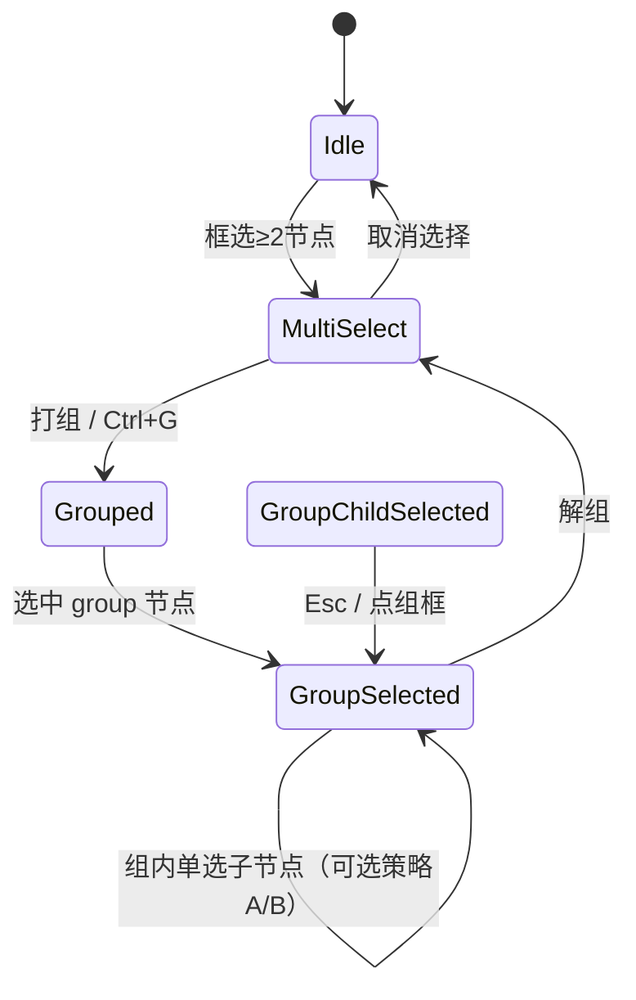

# 画布打组功能方案

> **状态**：产品方案（2026-05-21）  
> **依据**：LibTV《无限画布》参考图（分组选中态工具条）、[`LIBTV_GUIDE_ALIGNMENT.md`](./LIBTV_GUIDE_ALIGNMENT.md) §1.2.7 / §1.3、[`节点UI设计规范.txt`](../节点UI设计规范.txt) §五/§六、CanvasFlow 现有实现（`groupSelectedNodes` / `GroupNode` / `MultiSelectionToolbar`）  
> **层级**：创作体验层（CanvasExperienceLayer）+ 能力编排层（ProviderOrchestrationLayer，整组执行）  
> **形态约束**：对齐 LibTV **交互范式**，不引入底部 Dock；组内节点仍用**节点外浮层 + Inspector** 编辑，见 [`LIBTV_GUIDE_ALIGNMENT.md`](./LIBTV_GUIDE_ALIGNMENT.md)。

---

## 1. 打组的目的（Why）

打组不是「多选的高亮框」，而是把画布上**一组有业务关系的节点**固化为可复用的**工作单元**，服务于三类目标：

| 目的 | 用户场景 | 价值 |
|------|----------|------|
| **空间与认知整理** | 分镜一条线、一条广告 variant、一个角色相关节点挤在一起 | 移动/缩放/对齐时**整组**操作，减少误选与散落 |
| **批量操作入口** | 对「这一组分镜图 + 对应视频」统一排版、下载、执行 | 一次点击作用于**组成员**，而非逐个节点 |
| **生产链路封装** | 脚本 → 多图多视频的一条子流水线 | 为「整组执行」「转分镜组」「存入工具箱」预留**语义边界**（与 LibTV 分镜生产一致） |
| **复用与模板化** | 常用工作流（如「文生图→图生视频」两节点） | 组可**复制整组**（含连线）、未来可**入库为模板** |

**与「仅框选多选」的区别**：

- 框选：临时集合，松手或点空白即散；工具条为 `MultiSelectionToolbar`（宫格排列、创建副本、打组）。
- 打组：持久 `group` 父节点 + 子节点 `parentId`；选中组后进入**分组态**，工具条升级为 `GroupToolbar`（参考图一）。

---

## 2. LibTV 参考：分组态具备什么

依据参考图一（分组 2 个节点 + 顶栏工具条）及指南 **§1.2.7 节点操作**、**§1.3 工作流搭建**、批量操作描述，归纳 LibTV 分组态能力如下：

### 2.1 视觉与结构

- **组容器**：浅色描边矩形 + **四角缩放手柄**，可拖拽调整组区域大小。
- **组标题**：组外或组内左上角显示 **「分组 · N 个节点」**（或组自定义名 + 成员数）。
- **成员节点**：落在组框内，保持各自节点 Chrome（文本/图片等）；组边框不遮挡节点交互区。
- **组级选中**：单击组边框或标题选中「组」；框选组成员时等价于操作该组。

### 2.2 分组态工具条（参考图一，左→右）

| 序号 | 能力 | 意图 |
|------|------|------|
| 1 | **色标 / 组颜色** | 多组并存时快速区分（营销组蓝、分镜组绿等） |
| 2 | **宫格排列** | 组内成员按最大单元格等间距排版（与多选工具条第一项一致，作用域改为**组内**） |
| 3 | **整组执行** | 按 DAG 拓扑对组内（及组间必要连线）触发运行，类似「跑这一段工作流」 |
| 4 | **添加到工具箱** | 将组（节点 + 边 + 参数快照）存为可复用模板/宏 |
| 5 | **转分镜组** | 与脚本/分镜生产绑定：组内节点映射为镜头序列或 `scriptBeat` 范围（指南 §1.2.6 延伸） |
| 6 | **解组** | 删除组壳，子节点回到画布顶层坐标，**保留**节点与连线 |
| 7 | **批量下载** | 导出组内所有可下载产物（图/视频/音频）到本地 |

指南 **§1.2.7** 还强调：**副本**（保留连线）与**复制**（不保留连线）区分——打组后的「复制整组」应对齐**副本**语义。

### 2.3 打组前（多选态）与打组后（分组态）分工

| 阶段 | 触发 | 工具条 |
|------|------|--------|
| 多选 ≥2 节点 | 框选 / Shift 点选 | 宫格排列、保存到素材、批量下载、创建副本、**打组** |
| 选中 group 节点 | 打组完成或点选组框 | 色标、宫格、整组执行、工具箱、转分镜组、解组、批量下载 |

LibTV 将「布局」放在多选与分组两态均可出现；CanvasFlow 已有多选宫格，分组态应**默认再提供组内宫格**（作用域不同）。

---

## 3. CanvasFlow 现状与差距

### 3.1 已有能力

| 能力 | 实现位置 | 说明 |
|------|----------|------|
| 打组 | `projectStore.groupSelectedNodes` | ≥2 节点 → 创建 `type: group` 父节点，`parentId` |
| 解组 | `projectStore.ungroupSelectedNodes` | 选中 group → 移除壳，子节点坐标还原到画布 |
| 组框缩放 | `GroupNode` + `NodeResizer` | 选中组后四角自由拉伸（宽高压扁独立，不小于成员外接） |
| 拖入/拖出组 | `canvasGroupMembership.ts` | 拖拽结束按中心点移入/移出；标题「N 个节点」自动增减 |
| 组节点渲染 | `GroupNode.tsx` | 底板 + 外置标题「分组 · N 个节点」 |
| 多选工具条 | `MultiSelectionToolbar.tsx` | 宫格/副本/打组；无「整组执行」 |
| 快捷键 | `Ctrl+G` / `Ctrl+Alt+Shift+G` | 打组 / 解组 |
| 排列 | `arrangeSelectedNodes(grid\|h\|v)` | 仅作用于**当前选中 id**，未区分「组内成员」 |
| 图执行 | `runWorkflow` / `runNodeSubgraph` | 全图或单子图，**无「组边界」** |

### 3.2 主要差距（相对参考图一）

1. **无分组态专用工具条**——打组后仍像普通节点，或仍出现多选条（若同时选中子节点）。
2. **组标题无「N 个节点」**，色标、resize 手柄未做。
3. **整组执行 / 工具箱 / 转分镜组** 未定义行为与数据模型。
4. **组内排列**未绑定到 group（`arrangeSelectedNodes` 需识别 parentId === groupId）。
5. **组选中交互**未统一：点组框 vs 点子节点时的工具条与选中 id 策略不清晰。
6. **复制整组**（含组壳 + 子图 + 内部边）无一等公民，仅有「复制选中 + 粘贴偏移」。

---

## 4. 概念模型与状态机

### 4.1 数据模型（建议）

```text
GroupNode (type: "group")
├── id, position, style.width/height  // 可 resize
├── data.label                        // 组名，默认「分组」
├── data.memberCount                  // 派生或持久化
├── data.colorToken?                  // 组色标（可选）
├── data.kind?: "generic" | "storyboard"  // 是否分镜组（远期）
└── children[] via parentId
    ├── textNode | imageNode | videoNode | audioNode | scriptNode | ...
    └── extent: "parent"（移动组时子节点跟随）
```

**持久化**：随 `canvasflow.json` 节点列表保存；`memberCount` 建议运行时由 `parentId === group.id` 计算，避免漂移。

**连线**：组内边仍为普通 `edges`；组不单独作为边的端点。整组执行时以**组内节点 id 集合**为子图顶点裁剪边。

### 4.2 选中态状态机



**策略建议（需产品拍板）**：

| 策略 | 行为 | 推荐 |
|------|------|------|
| **A：组优先** | 选中 group 时只显示 `GroupToolbar`；点子节点先选中组再编辑子节点 | 对齐 LibTV 图一，**推荐** |
| **B：混合** | 点子节点显示该节点 Chrome，同时组框高亮 | 实现简单但工具条易混乱 |

推荐 **A**：分组态下默认 `selectedNodeIds = [groupId]`；双击子节点进入子节点编辑（不切换为「仅子节点选中」），或提供「进入组内编辑」显式模式。

---

## 5. 功能清单与优先级

### P0 — 分组态可用（对齐参考图主干）

| 编号 | 功能 | 说明 | 模块 |
|------|------|------|------|
| G0 | **分组态工具条** | 选中 group 时显示顶栏（胶囊 Dock 风格，与 `MultiSelectionToolbar` 一致） | `GroupToolbar.tsx` + `global.css` |
| G1 | **组标题「分组 · N 个节点」** | `GroupNode` 或组框 overlay 显示成员数 | `GroupNode` / store 派生 |
| G2 | **组内宫格排列** | 工具条按钮 → 对 `parentId === groupId` 的成员 `arrangeSelectedNodes("grid")` | `projectStore` 扩展 |
| G3 | **解组** | 工具条 + 现有 `ungroupSelectedNodes` | 已有，接入 UI |
| G4 | **组框 resize** | 拖拽四角手柄更新 `style.width/height`；子节点仍在 extent 内 | React Flow resize + 约束 |
| G5 | **选中语义（策略 A）** | 打组后选中 group；避免多选条与分组条并存 | `FlowCanvas` selection |

### P1 — 编排与资产（LibTV 差异化能力）

| 编号 | 功能 | 说明 |
|------|------|------|
| G6 | **整组执行** | 从组内节点中选取「入口节点」（无组内入边或用户指定），调用 `execute_subgraph_with_patch` 限定顶点集；展示组级进度 |
| G7 | **复制整组（副本）** | 复制 group + 子节点 + 组内边，新 id，偏移放置；对齐 LibTV「副本保留连线」 |
| G8 | **批量下载** | 遍历组内 media 节点收集 `path`，打包或依次导出到工程 `assets/export/` |
| G9 | **组色标** | 工具条色块切换 `data.colorToken` → 组框描边色 |

### P2 — 生产链路深化

| 编号 | 功能 | 说明 |
|------|------|------|
| G10 | **转分镜组** | 组标记 `kind: storyboard`；与 `scriptNode` / `scriptBeatSelection` 联动；入口在组内均为图/视频节点时可用 |
| G11 | **添加到工具箱** | 序列化组为 JSON 模板（节点+边+viewport 可选），本地 `templates/` 或工程内 `.canvasflow/templates` |
| G12 | **组级运行态** | 组框描边聚合子节点 `nodeRunStateById`（全跑中/部分失败） |
| G13 | **水平/垂直排列** | 组工具条二级菜单或长按宫格 |

---

## 6. 分组态 UI 方案（对齐软件整体）

### 6.1 工具条布局（参考图一 → CanvasFlow token）

与 [`MultiSelectionToolbar`](../../src/components/canvas/MultiSelectionToolbar.tsx)、[`canvas-color-system.md`](../design/canvas-color-system.md) 一致：

```text
┌─────────────────────────────────────────────────────────────────────────────┐
│ [■] │ [⊞ 宫格排列] │ [▶ 整组执行] [⊕ 添加到工具箱] [◎ 转分镜组] │ [解组] [↓ 批量下载] │
└─────────────────────────────────────────────────────────────────────────────┘
     ↑ 色标（P1）     ↑ 编排区（P1 可灰显+敬请期待）              ↑ 与多选条尾部分离
```

- **容器**：`--canvas-dock-bg`、`--canvas-dock-radius-pill`、顶栏居中于**组包围盒上方**（与多选条定位逻辑相同，`getNodesBounds([groupId])` 需含子节点外接矩形）。
- **禁用态**：`转分镜组` / `添加到工具箱` 在未接引擎前 `title="敬请期待"` + `--muted`，与当前多选条「保存到素材」一致。
- **主按钮**：`解组` 可用次要样式；`整组执行` 用 accent（与 LibTV 播放语义一致）。

### 6.2 组容器视觉

| 元素 | 规范 |
|------|------|
| 边框 | 1px `--cf-border-strong`，选中时 `--cf-accent-focus` 2px 外发光（弱） |
| 背景 | `rgba(255,255,255,0.03)` 内凹，不抢节点内容 |
| 标题 | 组框外左上：`分组 · 2 个节点`；可双击改名 |
| 手柄 | 四角 8px 方块，仅 group 选中时可拖 |
| 色标 | P1：标题旁色点或边框染色 |

### 6.3 与多选工具条的关系

- `nodes` 中无 group 且 `selectedNodeIds.length >= 2` → **仅** `MultiSelectionToolbar`。
- 选中含 `type === "group"` → **仅** `GroupToolbar`（隐藏 MultiSelection）。
- 避免两条工具条同时出现。

---

## 7. 关键逻辑说明

### 7.1 打组（创建）

1. 输入：≥2 个**顶层**节点（`!parentId`），且非 group 自身。
2. 计算成员外接矩形 + padding（现有 40px）。
3. 创建 `group` 节点，`style.width/height` 最小 260×220。
4. 子节点：`parentId = groupId`，`extent: "parent"`，坐标改为相对组左上角。
5. 选中切换为 `[groupId]`，触发 **G0 分组态工具条**。

**边界**：嵌套组（组内再打组）P0 不做，提示「请先解组」。

### 7.2 解组

1. 删除 group 节点。
2. 子节点：`parentId` 清空，`position` 加回组的世界坐标。
3. **不删除**组内连线。
4. 选中改为解组后的子节点 id 列表（或清空）。

### 7.3 组内宫格排列

- 收集 `nodes.filter(n => n.parentId === groupId)`。
- 以组内 **(0,0)** 或当前最小 x/y 为起点做 grid（复用 `arrangeSelectedNodes` 核心，传入成员 id 列表）。
- 排列后可选：自动扩展 `group.style.width/height` 包住新外接矩形。

### 7.4 整组执行（P1 设计要点）

- **入口节点规则**（默认）：组内入度为 0（相对组内边）的节点；多个入口则并行或提示用户选入口。
- **执行范围**：`vertices = 组内节点`，`edges = 两端均在 vertices 内的边`。
- **调用**：现有 Tauri `execute_subgraph_with_patch`；组级 toast：`组「xxx」执行中 / 完成 / 部分失败`。
- **与 Ctrl+Enter 关系**：全图无组选中时仍 `runWorkflow`；选中 group 时 `Ctrl+Enter` → 整组执行。

### 7.5 转分镜组（P2 概念）

- **目的**：把「这一组」声明为脚本节点下游的一个**分镜批次**（Hermes / `scriptBeatChain` 范围）。
- **前置**：组内存在 `scriptNode` 或组外有连线连到某 `scriptNode`；组内主要为 `imageNode` / `videoNode`。
- **行为**：写 `group.data.kind = "storyboard"`，可选绑定 `scriptBeatIds[]`；脚本工作台「按组生成」时只扫该组。
- 参考图一该按钮灰显 → P0/P1 可占位，P2 与 R4–R6 联动。

### 7.6 添加到工具箱（P2 概念）

- **目的**：保存可复用的「迷你工作流」片段（如「文案 + 文生图 + 图生视频」三节点模板）。
- **内容**：节点、边、相对坐标、组框尺寸；**不含** API Key、不含绝对 `assets` 路径（改为占位或相对工程路径）。
- **落地**：本地 JSON + 左侧 Dock「从工具箱插入」。

---

## 8. 与生产流的关系

```text
脚本节点 (scriptNode)
    │ scriptBeat / storyboardShots
    ▼
[ 分组：分镜组 ]  ← 「转分镜组」建立语义
    ├── imageNode × N
    └── videoNode × N
         │
         ▼ 整组执行 / 批量下载
    时间线 / 导出（远期）
```

打组是 **ProductionFlowLayer** 在画布上的**空间视图**；不替代 `scriptBeat` 数据真源，而是与其**对齐范围**（一组 ≈ 一批镜头相关节点）。

---

## 9. 建议迭代切分（低复杂度）

| 迭代 | 目标 | 模块（≤3） | 功能项 |
|------|------|------------|--------|
| **16-A** | 分组态 UI 骨架 | `GroupToolbar`、`GroupNode`、`FlowCanvas` selection | G0–G3、G1、G5 |
| **16-B** | 组几何与排列 | `projectStore`、`GroupNode` resize | G2、G4 |
| **16-C** | 编排 P1 | `projectStore`、Tauri executor、export | G6–G8 |
| **16-D** | 生产 P2 | script/Hermes、templates | G10–G11 |
| **16-E** | 分组态收尾 | `GroupToolbar`、`GroupNode`、group lib | G9、G12、G13 |

每轮须写清 **Out of scope**（见 [`ITERATION_TEMPLATE.md`](../iterations/ITERATION_TEMPLATE.md)）。

---

## 10. 非目标（方案阶段统一声明）

- 不实现 LibTV **云端**「主体库 / 合规素材库」同步。
- 不在 P0 做**嵌套组**、组内再组。
- 不把 group 作为连线的直接端点（仍连到具体媒体/脚本节点）。
- 不为此引入底部 Dock 或组内嵌套全屏编辑器。
- 组内节点**不**因打组而改变各自生成器 UI（仍节点外浮层）。

---

## 11. 验收标准（P0 完成后）

1. 框选 ≥2 节点 → 多选条「打组」→ 出现组框，标题含 **N 个节点**，仅显示**分组态工具条**。
2. 分组态点击 **宫格排列** → 组内节点错位不重叠，组框仍包住成员。
3. **解组**（工具条或 `Ctrl+Alt+Shift+G`）→ 组消失，节点与连线保留在画布原位置。
4. 拖拽组框 → 子节点跟随；拖组内单节点 → 仅在组内移动（extent parent）。
5. 与 [`SHORTCUTS.md`](./SHORTCUTS.md)、[`canvas-color-system.md`](../design/canvas-color-system.md) 视觉一致，无第二套蓝色 CTA 语言。

---

## 12. 决策记录

| 日期 | 决策 |
|------|------|
| 2026-05-21 | 首版方案：以 LibTV 参考图一分组态工具条为 P0 目标；CanvasFlow 保持节点外浮层，不抄底部 Dock。 |
| 2026-05-21 | 选中策略推荐 **A（组优先）**，避免多选条与分组条并存。 |
| 2026-05-21 | 「转分镜组」「工具箱」列为 P2，P0 可灰显占位。 |

---

## 13. 相关文件索引

| 类型 | 路径 |
|------|------|
| 现有打组逻辑 | [`src/store/projectStore.ts`](../../src/store/projectStore.ts) `groupSelectedNodes` / `ungroupSelectedNodes` |
| 组节点 UI | [`src/components/nodes/GroupNode.tsx`](../../src/components/nodes/GroupNode.tsx) |
| 多选工具条 | [`src/components/canvas/MultiSelectionToolbar.tsx`](../../src/components/canvas/MultiSelectionToolbar.tsx) |
| 排列 | [`src/store/projectStore.ts`](../../src/store/projectStore.ts) `arrangeSelectedNodes` |
| 子图执行 | [`src/store/projectWorkflowRuns.ts`](../../src/store/projectWorkflowRuns.ts) |
| LibTV 对齐 | [`docs/product/LIBTV_GUIDE_ALIGNMENT.md`](./LIBTV_GUIDE_ALIGNMENT.md) |
