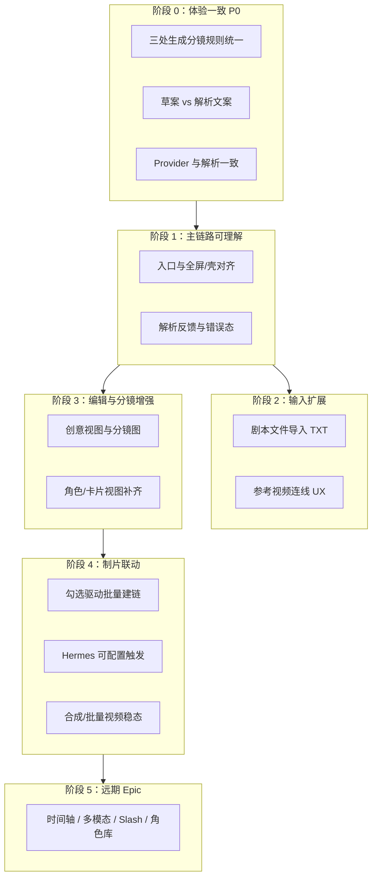

# 分镜脚本节点开发顺序规划

> **依据**：[脚本节点功能说明.md](./脚本节点功能说明.md) + [ROADMAP_V2.md](../iterations/ROADMAP_V2.md)（R3–R9 生产链路）  
> **原则**：每轮 1 个核心目标、≤3 模块、2–4 功能点；先**修一致性与主链路**，再**扩输入**，最后**制片联动与远期能力**。  
> **写法**：每阶段对应 1 份 `docs/iterations/iteration-XX-*.md` 执行单（模板见 [ITERATION_TEMPLATE.md](../iterations/ITERATION_TEMPLATE.md)）。

---

## 0. 当前基线（视为已完成，不再排期）

| 能力 | 参考 |
|------|------|
| 脚本工作台 v1（表/卡、批量、模板、全屏表） | R3、`iteration-03` / `iteration-06` |
| 分镜文案 LLM + 侧栏分镜区 | R4、`iteration-04` |
| DAG 解析 `run_script_node`、上游文本/参考视频路径 | `CURRENT_PROGRESS` §4.1 |
| 画布 Chrome（壳/顶底栏/展开 Modal） | `iteration-08` P0–P2 |
| `scriptBeatId` 下游绑定、粘贴重映射 | R2/R3 验收、Inspector |

后续迭代在以上基线上**修补、对齐、延伸**，避免重复「重做工作台」。

---

## 1. 总览：推荐开发顺序

**与全局 ROADMAP 关系**：阶段 0–1 属 **创作体验层**（脚本子集）；阶段 2–3 横跨 **创作体验 + 生产链路**；阶段 4 对齐 **R5–R6 + R9 局部**；阶段 5 独立 Epic，不挤进小迭代。

---

## 2. 阶段 0：体验一致（P0，建议连续 1–2 轮）

**为什么要先做**：功能说明已暴露「同一按钮、三种行为」与「草案被当成 AI 解析」类问题；不修会导致后续输入/联动验收全部失真。

### 迭代 0-A：「生成分镜」行为统一

| 项 | 内容 |
|----|------|
| **核心目标** | 画布顶栏、全屏顶栏、Inspector 分镜区对「勾选 / 全部」规则一致。 |
| **建议方案** | 顶栏默认 **有勾选→仅勾选，无勾选→全部**（与全屏一致）；Inspector 保留显式两按钮。 |
| **模块** | `ScriptPreviewToolbar.tsx`、`ScriptPreviewToolbarPortal`（如需）、`脚本节点功能说明.md` §3.3 更新 |
| **非目标** | 不改分镜 Agent、不改 `storyboardShots` 结构 |
| **验收** | 功能说明 §6 第 3 条三场景全通过且结果一致 |
| **回退** | 恢复顶栏「始终全部」行为 |

**Lib 对齐**：无新章节；属本地体验债。

---

### 迭代 0-B：生成路径可辨识 + Provider 一致 ✅

> 执行单：`docs/iterations/iteration-09-script-labels-provider.md`（2026-05-21 完成）

| 项 | 内容 |
|----|------|
| **核心目标** | 用户能区分「模板草案」与「AI 解析」；底栏所选 Provider 与 `run_script_node` 使用同一套。 |
| **功能点** | ① 草案按钮文案/说明（如「快速草案（本地模板，不调模型）」）② 解析按钮统一动词（「AI 解析镜头」）③ 执行器读取节点 `params.providerId`（或文档明确「仅设置页默认」并隐藏底栏 Provider） |
| **模块** | `ScriptWorkbenchPrimaryActions`、`ScriptComposerPanel`、`src-tauri/executor/script_node.rs` 或 `llm.rs` |
| **非目标** | 不改解析 JSON Schema |
| **验收** | 草案瞬时 3 条；解析有 running 状态；切换 Provider 后 runs.db/日志可见模型变化 |
| **回退** | 仅 UI 文案回退；Provider 逻辑回退到设置页默认 |

**层**：能力编排层（Provider）+ 创作体验层（文案）。

---

## 3. 阶段 1：主链路可理解（1–2 轮）

### 迭代 1-A：入口收敛（壳 / 全屏 / Inspector）✅

> 执行单：`docs/iterations/iteration-10-script-entry-converge.md`（2026-05-21 完成）

| 项 | 内容 |
|----|------|
| **核心目标** | 四条编辑入口职责清晰，减少「找不到全屏/主题」。 |
| **功能点** | ① 壳内迷你表行点击或明确按钮进全屏（可选）② 顶栏恢复「全屏」「编辑主题」为图标或二级（若产品坚持仅三键则：双击进全屏、长按/右键）③ `NodeMaximizedOverlay` 与 Inspector 入口说明一致 |
| **模块** | `MinimalScriptNode`、`ScriptNodeFullscreenOverlay`、产品说明 §3.3 |
| **非目标** | 不重写 `ScriptNodeWorkbench` |
| **验收** | 新用户 3 分钟内能：改主题 → 解析 → 全屏改表 → 生成分镜 |
| **UI/UX** | 须写 UI 小节（壳/顶栏/全屏） |

**依赖**：阶段 0-B 文案清晰。

---

### 迭代 1-B：解析与生成反馈 ✅

> 执行单：`docs/iterations/iteration-10-script-parse-feedback.md`（2026-05-21 完成）

| 项 | 内容 |
|----|------|
| **核心目标** | 解析/分镜/重新生成失败可读，与节点 `status`、状态栏一致。 |
| **功能点** | ① 顶栏/底栏 busy 与 `data.status` 双写对齐 ② 解析 0 条镜头时的引导（改 prompt / 看运行日志）③ 分镜失败条目在创意视图可定位 beat |
| **模块** | `ScriptPreviewToolbar`、`ScriptComposerPanel`、`ScriptCreativeViewGrid`（若有）、`useNodeStatus` |
| **非目标** | WebSocket 真进度 |
| **验收** | 断网/无 Key/空 prompt 三类失败均有明确文案 |

**层**：生产链路层 + 资产与质量层（可观测）。

---

## 4. 阶段 2：输入扩展（1–2 轮）

对齐功能说明 §3.1 中仍为 ⚠️ 的项；**不做** Excel / 多模态 Epic。

### 迭代 2-A：上游文本节点剧本导入 ✅

> 执行单：`docs/iterations/iteration-11-script-upstream-text.md`（2026-05-21）  
> **产品口径**：剧本在**上游文本节点**中编辑，连线导入；**非**本机 `.txt` 选文件。

| 项 | 内容 |
|----|------|
| **核心目标** | 用户能发现「文本→脚本」连线即剧本导入；解析时底栏=要求、文本=正文（与 `run_script_node` 一致）。 |
| **模块** | `scriptUpstreamText.ts`、`ScriptUpstreamTextBanner`、壳/Inspector/底栏提示 |
| **非目标** | 文件对话框、Word/Excel、自动解析 |
| **验收** | 文本节点 10k 字 + 连线 → 壳/Inspector 可见字数 → 底栏写要求 → AI 解析 → beats 合理 |
| **Lib 对齐** | §1.2.6 上传剧本（本地子集：粘贴于文本节点） |

---

### 迭代 2-B：参考视频输入可发现

| 项 | 内容 |
|----|------|
| **核心目标** | 用户知道「连 videoNode ≠ 真看视频」，但路径会进入解析。 |
| **功能点** | ① 脚本节点侧栏/空态提示「已连接 N 个参考视频」② 解析要求模板一键插入参考块 ③ 执行日志事件标 `reference_video_paths` |
| **模块** | `incomingScriptBinding` / 新 helper、`executor.rs` 事件、`Inspector` 或壳角标 |
| **非目标** | 视频抽帧、多模态模型 |
| **验收** | 仅连 video、无文本 → 解析可跑且 prompt 含路径列表 |

---

## 5. 阶段 3：编辑与分镜增强（2–3 轮）

### 迭代 3-A：创意视图 ↔ 分镜资产

| 项 | 内容 |
|----|------|
| **核心目标** | 全屏「创意视图」成为分镜图/文案的主浏览面（对齐 Lib「衔接分镜图」子集）。 |
| **功能点** | ① 缩略图网格与 beat 勾选联动 ② 本机选图入口显眼 ③ 从格子跳转 Inspector 分镜区或定位画布节点 |
| **模块** | `ScriptCreativeViewGrid`、`ScriptNodeFullscreenOverlay` |
| **非目标** | 云端批量文生图（归 R4 图片节点跨节点迭代） |
| **验收** | 全屏 Tab 切换后勾选与侧栏分镜区一致 |

---

### 迭代 3-B：角色与卡片视图

| 项 | 内容 |
|----|------|
| **核心目标** | `characters[]` 与卡片视图达到表格同级可编辑性。 |
| **功能点** | ① 卡片视图展示角色摘要 ② `ScriptRolePopoverEditor` 关键路径缩短 ③ 角色图列与卡片联动 |
| **模块** | `ScriptWorkbenchCardView`、`ScriptCharactersCell` |
| **非目标** | 全局角色库实体 |
| **验收** | 纯卡片流完成：增删镜头、改角色、生成分镜 |

---

### 迭代 3-C（可选）：本地模板与工程级共享

| 项 | 内容 |
|----|------|
| **核心目标** | 模板从「浏览器 localStorage」升级为「随工程或可导出模板包」二选一。 |
| **优先级** | 低于 3-A/3-B；可与 R8 资产库合并 |
| **非目标** | 云端模板市场 |

---

## 6. 阶段 4：制片联动（2–3 轮，依赖 R5 视频基建）

### 迭代 4-A：勾选驱动的批量建链

| 项 | 内容 |
|----|------|
| **核心目标** | 「进入分镜区」之后，一键只为**勾选 beat** 创建 image/video，并写 `scriptBeatId`。 |
| **模块** | `ScriptStoryboardSection`、已有 `buildFromScript` / Hermes helpers |
| **非目标** | 新节点类型 |
| **验收** | 勾选 2/10 → 仅 2 对 image/video；粘贴子图 beatId 仍正确 |

---

### 迭代 4-B：Hermes 触发策略产品化

| 项 | 内容 |
|----|------|
| **核心目标** | 明确「何时自动建链」：例如分镜文案完成后提示 / 设置开关 / 仅勾选。 |
| **模块** | `hermes/autoChain.ts`、设置页或脚本节点 params |
| **非目标** | 全自动无人值守跑完全片 |
| **验收** | 关闭开关时不 spawn 节点；开启时仅 `storyboardShots` 齐全后执行 |

---

### 迭代 4-C：批量视频 + 合成导出稳态

| 项 | 内容 |
|----|------|
| **核心目标** | 分镜区「批量视频」「合成导出」可重复验收，错误可恢复。 |
| **依赖** | R5 视频任务引擎、`iteration-07` 相关能力稳定 |
| **模块** | `batchGenerateVideos`、`assessScriptComposeReadiness`、`timeline-export` |
| **验收** | 3 镜勾选 → 批量视频有进度 → 合成 mp4 或明确失败原因 |

**ROADMAP**：对齐 **R5 + R6** 脚本侧入口。

---

## 7. 阶段 5：远期 Epic（独立排期，禁止塞进小迭代）

以下对应功能说明 §5，每项需 **独立 Epic + 对照表更新**：

| Epic | 说明 | 建议全局轮次 |
|------|------|--------------|
| **E1 全局时间轴** | `timeIn/timeOut` 计算、时间轴 UI、合成对齐 | R6 深化 |
| **E2 多模态反推** | 视频/图集 → beats，非路径 prompt | 新 Epic |
| **E3 Lib Slash 分镜工具** | 九宫格、剧情推演等（§2.1） | R8 或独立 |
| **E4 全局角色/主体库** | roleId 跨节点、主体库 | R8 |
| **E5 云端批量分镜图** | 脚本 beat → 图片节点批量生成 | R4–R5 跨节点 |

---

## 8. 建议时间线（可并行标注）

| 顺序 | 迭代 ID | 名称 | 预估 | 可并行 |
|------|---------|------|------|--------|
| 1 | script-09-0A | 生成分镜规则统一 | 0.5–1d | ✅ 见 `iteration-09-script-storyboard-scope-unify.md` |
| 2 | script-09-0B | 草案/解析/Provider | 1–2d | 与 0A 可同轮若控范围 |
| 3 | script-10-1A | 入口收敛 | 1–2d | ✅ `iteration-10-script-entry-converge.md` |
| 4 | script-10-1B | 解析反馈 | 1d | ✅ `iteration-10-script-parse-feedback.md` |
| 5 | script-11-2A | 上游文本剧本导入 | 1–2d | ✅ `iteration-11-script-upstream-text.md` |
| 6 | script-11-2B | 参考视频 UX | 1d | ✅ `iteration-11-script-reference-video.md` |
| 7 | script-12-3A | 创意视图 | 2–3d | ✅ `iteration-12-script-creative-view.md` |
| 8 | script-12-3B | 角色/卡片 | 2d | ✅ `iteration-12-script-card-roles.md` |
| 9 | script-13-4A | 勾选建链 | 1–2d | ✅ `iteration-13-script-beat-chain.md` |
| 10 | script-13-4B | Hermes 策略 | 1d | ✅ `iteration-13-hermes-auto-chain-policy.md` |
| 11 | script-14-4C | 批量视频/合成 | 2–4d | **强依赖** R5 视频稳定 |

编号 `script-09` 接续 `iteration-08-script-node-chrome`，避免与全局 R 号混淆；执行单文件名示例：`iteration-09-script-storyboard-scope-unify.md`。

---

## 9. 每层映射（CONTRIBUTING 四层）

| 阶段 | 主要层 |
|------|--------|
| 0–1 | 创作体验层（CanvasExperienceLayer） |
| 0-B、2-B | + 能力编排层（ProviderOrchestrationLayer） |
| 2–3 | 生产链路层（ProductionFlowLayer） |
| 4 | 生产链路 + 资产与质量层 |
| 5 | 跨四层 Epic |

---

## 10. 下一轮建议立即开工

阶段 0–4C 脚本子集主线已完成。若只选 **一轮** 开工，推荐：

**阶段 5 Epic 排期**（E1 全局时间轴 / E2 多模态反推 等，见 §7）或 **R5/R6 全局视频引擎深化**。

**已完成**：`script-14-4C` 批量视频/合成稳态 ✅（`iteration-14-script-production-export.md`）  
**已完成**：`script-13-4B` Hermes 策略 ✅ · `script-13-4A` 勾选建链 ✅  
**已完成**：`script-11-2B` 参考视频输入可发现 ✅（2026-05-21）

---

## 11. 相关文档

- 功能真源：[脚本节点功能说明.md](./脚本节点功能说明.md)
- Lib 对照：[LIBTV_GUIDE_ALIGNMENT.md](./LIBTV_GUIDE_ALIGNMENT.md)
- 全局路线：[ROADMAP_V2.md](../iterations/ROADMAP_V2.md)
- 验收步骤：[R3_小白验收操作指南_2026-04.md](../iterations/R3_小白验收操作指南_2026-04.md)

---

## 修订记录

| 日期 | 变更 |
|------|------|
| 2026-05-21 | 首版：基于功能说明与 ROADMAP 拆 0–5 阶段及 11 步迭代建议。 |
